# DriveWiki Super Spec v1.0

> **Codename:** DriveWiki
> **Product:** Enterprise Google Drive Knowledge Management System
> **Target Market:** Large organizations (1000+ employees) in Thailand / SEA
> **Spec Author:** Iron Man (AEGIS System Architect)
> **Date:** 2026-04-17
> **Status:** DRAFT -- Pending Loki Review

---

## Soul

ระบบจัดการความรู้ระดับองค์กรที่เงียบสงบแต่ทรงพลัง DriveWiki ไม่ใช่ search engine อีกตัว --
มันคือ "สมองรวม" ขององค์กรที่ Agent คอยดูแลให้ทันสมัยอยู่เสมอ
ตาม Karpathy's LLM Wiki Pattern (April 2026) ทุก document ที่เข้าสู่ระบบจะถูกแปลงเป็น wiki pages
ที่เชื่อมโยงกัน ค้นหาได้ทันที และ compound ความรู้ทุกครั้งที่มีคนถาม
เราเลือก explainability เหนือ cleverness -- ถ้า CEO ถามว่า "ทำไมระบบตอบแบบนี้"
audit log ต้องตอบได้ในหนึ่งหน้าจอ

---

## Table of Contents

1. [Context Recap & Assumptions](#section-1-context-recap--assumptions)
2. [Research Insights & Feature Landscape](#section-2-research-insights--feature-landscape)
3. [Super System Analysis](#section-3-super-system-analysis)
4. [BRD (Business Requirements)](#section-4-brd-business-requirements)
5. [SRS (Functional Requirements)](#section-5-srs-functional-requirements)
6. [UX/UI Blueprint](#section-6-uxui-blueprint)
7. [PBIs (Product Backlog Items)](#section-7-pbis-product-backlog-items)
8. [Role Summary](#section-8-role-summary)
9. [Open Questions & Gaps](#section-9-open-questions--gaps)

---

# Section 1: Context Recap & Assumptions

## 1.1 Project Context

DriveWiki คือระบบ Enterprise Knowledge Management ที่ออกแบบมาเฉพาะสำหรับองค์กรขนาดใหญ่ในไทย/SEA
ที่ใช้ Google Workspace เป็นหลัก ระบบใช้ Karpathy's LLM Wiki Pattern แทน traditional RAG
โดยมี LLM Agent เป็นผู้ดูแล wiki layer ทั้งหมด

### Core Innovation: Karpathy's LLM Wiki Pattern

แทนที่จะใช้ vector database + retrieval ระบบ DriveWiki ใช้ 3-layer architecture:

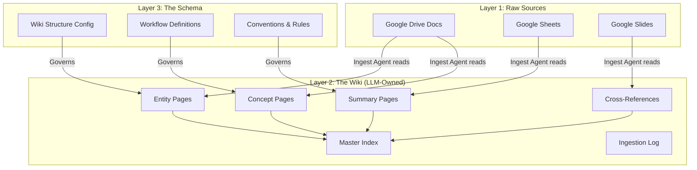

## 1.2 Assumptions

| # | Assumption | Impact | Status |
|---|-----------|--------|--------|
| A-01 | องค์กรเป้าหมายใช้ Google Workspace เป็น primary productivity suite | [ASSUMED] ถ้าใช้ M365 ต้อง redesign integration layer | HIGH |
| A-02 | ภาษาหลักของเอกสารคือ ไทย + อังกฤษ (bilingual) | [ASSUMED] รองรับ 2 ภาษาเท่านั้นใน v1 | MEDIUM |
| A-03 | Vertex AI (Gemini) มี throughput เพียงพอสำหรับ 1000+ users concurrent | [ASSUMED] ต้อง load test ก่อน production | HIGH |
| A-04 | Google Drive API webhooks มี reliability เพียงพอสำหรับ real-time sync | [ASSUMED] ต้องมี scheduled sync เป็น fallback | MEDIUM |
| A-05 | องค์กรมี Google Workspace Admin ที่สามารถ grant domain-wide delegation ได้ | [ASSUMED] จำเป็นสำหรับ service account access | HIGH |
| A-06 | Cloud Run สามารถ handle long-running wiki compilation tasks ได้ (max 60 min) | [ASSUMED] อาจต้องใช้ Cloud Tasks สำหรับ jobs > 15 min | MEDIUM |
| A-07 | Prisma ORM รองรับ PostgreSQL full-text search ที่เพียงพอสำหรับ wiki index | [ASSUMED] อาจต้อง raw SQL สำหรับ Thai tokenization | MEDIUM |
| A-08 | PDPA (Personal Data Protection Act) compliance เพียงพอด้วย encryption at rest + audit log | [ASSUMED] ต้อง legal review | HIGH |
| A-09 | Budget ต่อองค์กรอยู่ที่ ~$5,000-15,000/month สำหรับ GCP resources | [ASSUMED] ขึ้นกับ document volume | MEDIUM |
| A-10 | Karpathy's minbpe tokenizer รองรับภาษาไทย | [ASSUMED] ต้อง validate ก่อน commit | HIGH |
| A-11 | ทุก department มี folder structure ใน Google Drive ที่ชัดเจน | [ASSUMED] อาจต้อง onboarding wizard | LOW |
| A-12 | Enterprise customers ยอมรับ markdown-based wiki (ไม่ต้อง WYSIWYG editor) | [ASSUMED] อาจต้อง rich preview layer | MEDIUM |

## 1.3 Constraints

| Constraint | Detail |
|-----------|--------|
| Single Integration | Google Workspace only -- ไม่รองรับ M365, Slack, etc. ใน v1 |
| Cloud Provider | Google Cloud Platform exclusively |
| Language Runtime | Node.js/TypeScript -- no Python services ใน v1 |
| ORM | Prisma -- ไม่ใช้ raw query ยกเว้น full-text search |
| LLM Provider | Vertex AI (Gemini) -- ไม่ใช้ OpenAI หรือ Anthropic ใน v1 |
| Auth | Google Workspace SSO only -- ไม่มี local account |
| Data Residency | GCP region asia-southeast1 (Singapore) หรือ asia-southeast2 (Jakarta) |

## 1.4 Glossary

| Term | Definition |
|------|-----------|
| Wiki Page | Markdown document ที่ LLM Agent สร้างและดูแล แบ่งเป็น Entity Page, Concept Page, Summary Page |
| Entity Page | Wiki page ที่อธิบาย entity เฉพาะเจาะจง เช่น โปรเจค, บุคคล, ผลิตภัณฑ์ |
| Concept Page | Wiki page ที่อธิบาย concept หรือ topic กว้างๆ เช่น "นโยบายการลา", "กระบวนการ procurement" |
| Ingestion | กระบวนการนำเอกสารจาก Google Drive เข้าสู่ระบบและสร้าง/อัปเดต wiki pages |
| Lint | กระบวนการตรวจสอบ wiki อัตโนมัติ สำหรับ contradictions, stale data, orphan pages |
| Schema | Configuration ที่กำหนดโครงสร้าง wiki, conventions, และ workflows |
| Raw Source | เอกสารต้นฉบับใน Google Drive -- ระบบอ่านได้แต่ไม่แก้ไข (immutable principle) |
| qmd | Hybrid search (BM25 + vector + LLM re-ranking) ตาม Karpathy's toolchain |
| minbpe | Byte-pair encoding tokenizer สำหรับ efficient document processing |
| HMAC Audit | Hash-based Message Authentication Code สำหรับ tamper-evident logging |

---

# Section 2: Research Insights & Feature Landscape

## 2.1 Karpathy's LLM Wiki Pattern -- Architectural Rationale

Andrej Karpathy เผยแพร่ LLM Wiki Pattern ในเดือน April 2026 โดยชี้ให้เห็นปัญหาหลักของ traditional RAG:

| Problem with RAG | How Wiki Pattern Solves It |
|-----------------|---------------------------|
| Retrieval latency + relevance ไม่แน่นอน | Wiki อยู่ใน context window เสมอ -- ไม่ต้อง retrieve |
| Knowledge ไม่ compound | ทุก query สามารถ improve wiki ได้ (filed pages) |
| Cross-references หายไปใน vector space | Agent maintain cross-references explicitly |
| Stale data ไม่มีใครดูแล | Lint process ตรวจสอบ contradictions อัตโนมัติ |
| Chunk boundaries ตัดบริบท | Wiki pages มี semantic boundaries ที่สมบูรณ์ |

### ทำไมถึงเลือก Wiki Pattern สำหรับ DriveWiki

สำหรับองค์กรขนาดใหญ่ ปัญหาหลักไม่ใช่ "ค้นหาเอกสาร" แต่คือ "เชื่อมโยงความรู้ข้ามแผนก"
Wiki Pattern ทำให้ Agent สามารถ:
1. สร้าง entity pages ที่รวบรวมข้อมูลจากหลายเอกสาร/หลายแผนก
2. Maintain cross-references อัตโนมัติ เช่น โปรเจค A ที่ฝ่ายขายพูดถึง link ไปยัง spec ของฝ่าย IT
3. Compound ความรู้ -- คำถามที่ดีกลายเป็น wiki page ใหม่
4. Lint เพื่อหา contradictions -- เช่น นโยบายฝ่าย HR vs สิ่งที่ฝ่ายบัญชีปฏิบัติ

## 2.2 Feature Classification

### Must-Have (v1.0 -- MVP)

| Feature | Rationale | Complexity |
|---------|-----------|------------|
| Google Workspace SSO (OAuth 2.0) | ไม่มี login อื่น -- single identity | M |
| Google Drive webhook + scheduled sync | Real-time + reliability fallback | L |
| LLM Wiki compilation (entity + concept + summary pages) | Core innovation -- Karpathy pattern | XL |
| Master Index + cross-reference maintenance | ทำให้ wiki searchable + navigable | L |
| Chat interface (wiki-first, raw-source fallback) | Primary user interaction | L |
| Department-scoped RBAC | Enterprise requirement -- data isolation | M |
| HMAC audit trail | Compliance + tamper evidence | M |
| Thai + English bilingual UI | Target market requirement | M |
| Admin dashboard (user mgmt, department mgmt) | Enterprise governance | M |
| Per-department cost tracking | Budget control | S |

### Nice-to-Have (v1.1)

| Feature | Rationale | Complexity |
|---------|-----------|------------|
| Approval workflow for wiki edits | Enterprise governance -- some orgs want human-in-the-loop | M |
| Wiki page versioning + diff view | Transparency -- เห็นว่า Agent เปลี่ยนอะไร | M |
| Scheduled lint reports (email/Slack) | Proactive quality maintenance | S |
| Custom schema editor | ให้ admin กำหนด wiki structure เอง | L |
| Export wiki to PDF/Confluence | Integration with existing tools | M |
| qmd hybrid search (BM25 + vector + LLM re-ranking) | Scale beyond context window limit | L |

### Experimental (v2.0+)

| Feature | Rationale | Complexity |
|---------|-----------|------------|
| minbpe custom tokenizer for Thai | Efficient processing -- ต้อง validate Thai support ก่อน | L |
| Obsidian-compatible markdown export | Power users ที่ใช้ Obsidian | M |
| Knowledge graph visualization (3D) | Executive dashboard -- wow factor | L |
| Auto-generate onboarding materials from wiki | HR use case | M |
| Multi-workspace federation | สำหรับ holding companies | XL |
| Voice query (Thai speech-to-text) | Mobile use case | L |

### Not Recommended (v1.0)

| Feature | Reason |
|---------|--------|
| WYSIWYG wiki editor for humans | ขัดกับ Karpathy pattern -- Agent owns wiki layer |
| Microsoft 365 integration | Out of scope, dilutes focus |
| Custom LLM fine-tuning | Vertex AI Gemini เพียงพอ, fine-tuning เพิ่ม complexity |
| Real-time collaborative editing | ไม่ใช่ Google Docs replacement |
| Mobile native app | PWA เพียงพอสำหรับ v1 |

## 2.3 Competitive Landscape

| Product | Strengths | Weaknesses vs DriveWiki |
|---------|-----------|------------------------|
| **Notion AI** | Great UX, integrated workspace | ไม่ auto-compile wiki จาก Drive, ไม่มี department scoping, ไม่ focus Thai |
| **Glean** | Enterprise search, many integrations | RAG-based (no knowledge compounding), แพงมาก, ไม่มี wiki layer |
| **Guru** | Knowledge base + verification | Manual curation, ไม่มี LLM agent maintenance |
| **Confluence AI** | Deep Atlassian integration | ต้อง manual สร้าง pages, AI เป็น assistant ไม่ใช่ owner |
| **Google Cloud Search** | Native Google integration | Search only -- ไม่มี wiki compilation, ไม่มี knowledge compounding |
| **DriveWiki (ours)** | LLM Wiki Pattern, auto-compilation, Thai-first, department scoping, knowledge compounding | ใหม่ -- ยังไม่ proven at scale |

### Differentiation Summary

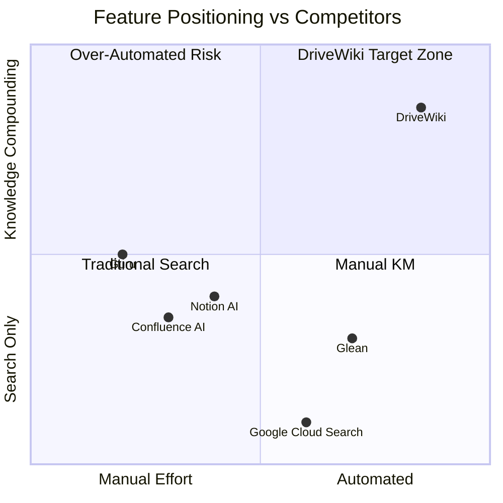

---

# Section 3: Super System Analysis

## 3.1 Stakeholders

| Stakeholder | Role | Primary Need | Interaction Frequency |
|------------|------|-------------|----------------------|
| **IT Admin** | ติดตั้ง, configure, maintain ระบบ | Easy setup, monitoring, cost control | Daily |
| **Department Head** | จัดการ knowledge scope ของแผนก | ดูภาพรวมความรู้แผนก, approve content policies | Weekly |
| **Knowledge Worker** | ผู้ใช้หลัก -- ค้นหา, ถาม, อ่าน wiki | คำตอบเร็ว ถูกต้อง มี context | Daily (5-20 queries) |
| **Executive** | ดูภาพรวม, ROI, usage metrics | Dashboard, cost justification | Monthly |
| **Compliance Officer** | ตรวจสอบ audit trail, data governance | HMAC logs, access reports, PDPA compliance | Weekly |
| **Google Workspace Admin** | Grant API permissions, domain-wide delegation | Clear setup instructions | One-time + maintenance |

## 3.2 User Journeys

### Journey 1: Organization Onboarding (IT Admin)

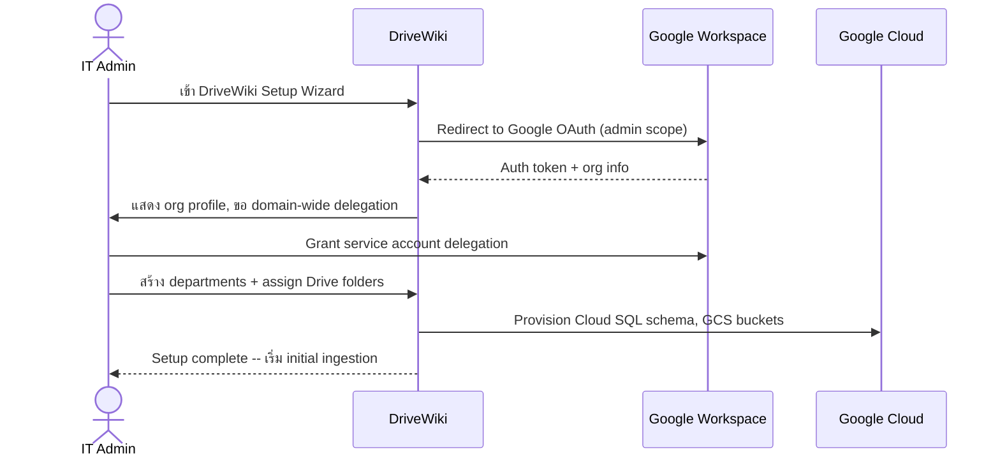

### Journey 2: Initial Drive Ingestion (System)

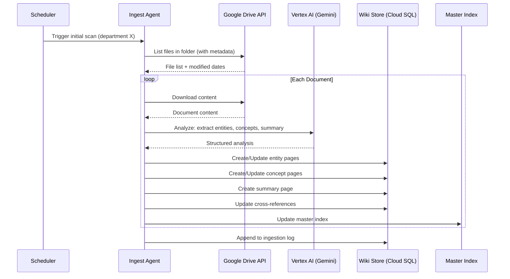

### Journey 3: Knowledge Worker Chat Query

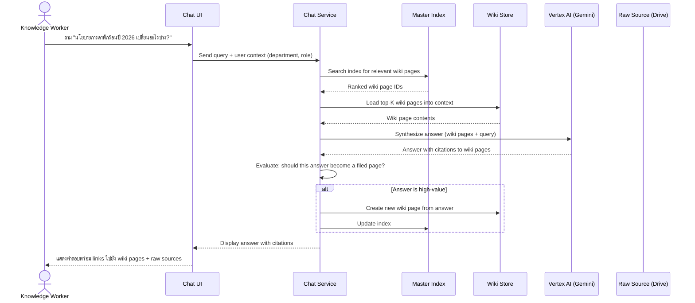

### Journey 4: Wiki Lint Process (System)

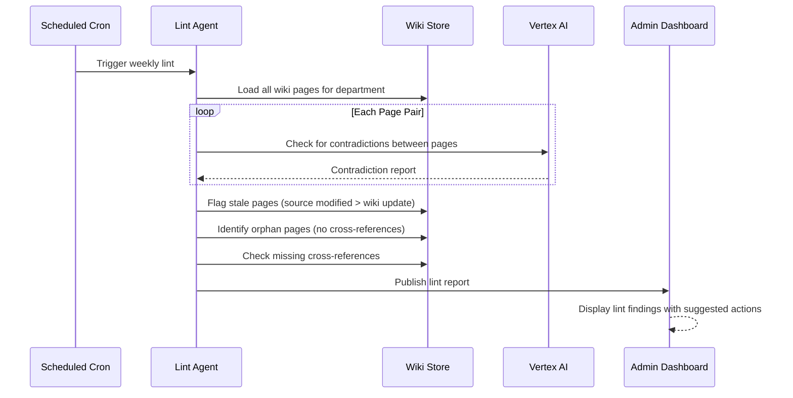

### Journey 5: Department Head -- Knowledge Overview

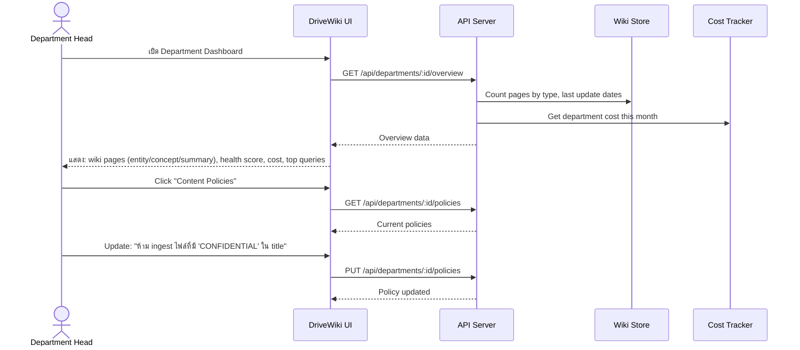

### Journey 6: Compliance Officer -- Audit Review

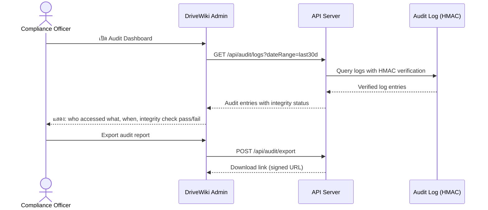

## 3.3 System Context Diagram

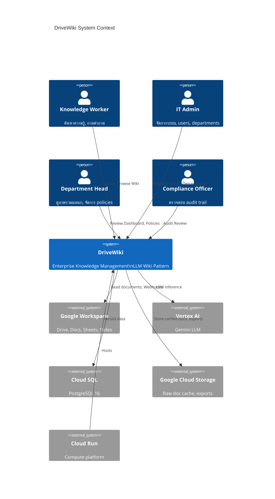

## 3.4 Major Components

| # | Component | Responsibility | Interface | Technology |
|---|-----------|---------------|-----------|------------|
| C-01 | **Auth Gateway** | OAuth 2.0 flow, JWT issuance, RBAC enforcement | REST API + middleware | Passport.js, Google OAuth |
| C-02 | **Drive Sync Engine** | Webhook listener, scheduled scan, doc download, change detection | Internal service + webhook endpoint | Google Drive API v3 |
| C-03 | **Ingest Agent** | อ่าน raw docs, แยก entities/concepts, สร้าง wiki pages | Internal service (event-driven) | Vertex AI Gemini |
| C-04 | **Wiki Store** | CRUD wiki pages, cross-references, master index | Internal service + Prisma | Cloud SQL (PostgreSQL 16) |
| C-05 | **Chat Engine** | Query processing, wiki context loading, answer synthesis | REST API + WebSocket | Vertex AI Gemini |
| C-06 | **Lint Agent** | Contradiction detection, stale page flagging, orphan cleanup | Scheduled job | Vertex AI Gemini |
| C-07 | **Admin Service** | User mgmt, department mgmt, policies, cost tracking | REST API | Prisma + Cloud SQL |
| C-08 | **Audit Logger** | HMAC-signed log entries, tamper detection, export | Internal service | Cloud SQL + HMAC-SHA256 |
| C-09 | **Cost Tracker** | Per-user/department LLM token counting, GCP cost allocation | Internal service | Cloud SQL |
| C-10 | **Schema Manager** | Wiki structure config, conventions, workflow definitions | Internal service + admin UI | JSON/YAML config + Cloud SQL |
| C-11 | **Notification Service** | Email/in-app notifications for lint reports, ingestion status | Internal service | Cloud Tasks + email API |
| C-12 | **Search Service** | Full-text search on wiki pages, BM25 ranking | Internal service | PostgreSQL FTS + custom Thai tokenizer |

## 3.5 Data Entities

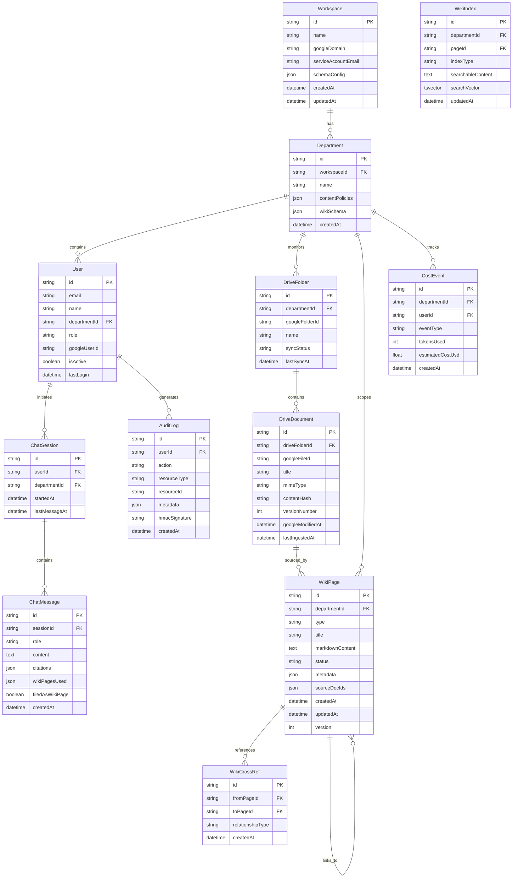

## 3.6 Non-Functional Requirements (NFRs)

### Performance

| ID | Requirement | Target | Measurement |
|----|------------|--------|-------------|
| NFR-PERF-01 | Chat query response time (wiki-first) | < 3 seconds (p95) | Response time from query to first token |
| NFR-PERF-02 | Chat query response time (raw-source fallback) | < 8 seconds (p95) | Response time with Drive API fetch |
| NFR-PERF-03 | Single document ingestion time | < 30 seconds | From webhook trigger to wiki pages updated |
| NFR-PERF-04 | Wiki page load time | < 500ms | API response time |
| NFR-PERF-05 | Search result time | < 1 second | From query to ranked results |
| NFR-PERF-06 | Dashboard load time | < 2 seconds | Full page render |

### Availability

| ID | Requirement | Target |
|----|------------|--------|
| NFR-AVAIL-01 | System uptime | 99.5% (monthly) |
| NFR-AVAIL-02 | Planned maintenance window | < 1 hour/month, off-peak only |
| NFR-AVAIL-03 | RTO (Recovery Time Objective) | < 4 hours |
| NFR-AVAIL-04 | RPO (Recovery Point Objective) | < 1 hour |

### Security

| ID | Requirement | Target |
|----|------------|--------|
| NFR-SEC-01 | Authentication | Google Workspace SSO (OAuth 2.0) only |
| NFR-SEC-02 | Authorization | RBAC with department scoping |
| NFR-SEC-03 | Data encryption at rest | AES-256 (Cloud SQL + GCS default) |
| NFR-SEC-04 | Data encryption in transit | TLS 1.3 |
| NFR-SEC-05 | Audit trail integrity | HMAC-SHA256 signed log entries |
| NFR-SEC-06 | Secrets management | Google Secret Manager |
| NFR-SEC-07 | API rate limiting | 100 req/min per user, 1000 req/min per department |

### Scalability

| ID | Requirement | Target |
|----|------------|--------|
| NFR-SCALE-01 | Concurrent users | 500 simultaneous |
| NFR-SCALE-02 | Total documents per workspace | 100,000+ |
| NFR-SCALE-03 | Wiki pages per department | 50,000+ |
| NFR-SCALE-04 | Departments per workspace | 100+ |
| NFR-SCALE-05 | Cloud Run auto-scaling | 1-50 instances |

### Compliance

| ID | Requirement | Target |
|----|------------|--------|
| NFR-COMP-01 | PDPA compliance | Data residency in SEA region |
| NFR-COMP-02 | Data retention policy | Configurable per workspace (default 7 years) |
| NFR-COMP-03 | Right to erasure | User data deletion within 30 days of request |
| NFR-COMP-04 | Consent management | Explicit consent at first login |
| NFR-COMP-05 | Cross-border data transfer | Restricted to configured GCP regions |

---

# Section 4: BRD (Business Requirements)

## 4.1 Problem Statement

องค์กรขนาดใหญ่ในไทย (1000+ พนักงาน) ที่ใช้ Google Workspace เผชิญกับปัญหา **Knowledge Silos**:

1. **เอกสารกระจัดกระจาย** -- ข้อมูลอยู่ใน Drive folders หลายร้อยแห่ง ไม่มี cross-reference
2. **ค้นหาไม่เจอ** -- Google Drive search ใช้ keyword matching ไม่เข้าใจ context
3. **ความรู้ไม่ compound** -- ทุกครั้งที่คนถามคำถามเดิม ต้องค้นหาใหม่
4. **ข้ามแผนกไม่ได้** -- ฝ่ายขายไม่รู้ว่าฝ่าย IT มี spec อะไร
5. **ไม่มี audit trail** -- ไม่รู้ว่าใครเข้าถึงความรู้อะไร เมื่อไร
6. **ค่าใช้จ่ายมืด** -- ไม่รู้ว่าแต่ละแผนกใช้ resources เท่าไร

### Business Impact

- พนักงานเสียเวลาเฉลี่ย **2.5 ชั่วโมง/วัน** ค้นหาข้อมูล (McKinsey 2024)
- **40%** ของความรู้องค์กรอยู่ใน "dark data" -- เอกสารที่มีอยู่แต่ค้นไม่เจอ
- Onboarding พนักงานใหม่ใช้เวลา **3-6 เดือน** กว่าจะรู้ว่าข้อมูลอยู่ที่ไหน
- ตัดสินใจผิดเพราะใช้ข้อมูลเก่า หรือไม่รู้ว่ามีข้อมูลใหม่

## 4.2 Business Goals & KPIs

| Goal | KPI | 6-Month Target |
|------|-----|---------------|
| ลดเวลาค้นหาข้อมูล | Average time-to-answer | < 30 seconds (จากปัจจุบัน ~15 min) |
| เพิ่ม knowledge utilization | % documents ingested vs total Drive docs | > 80% |
| ลดเวลา onboarding | Time for new hire to find first answer | < 5 minutes |
| Cross-department knowledge sharing | % queries ที่ใช้ wiki pages จากหลายแผนก | > 25% |
| Audit compliance | % actions ที่มี HMAC-verified audit log | 100% |
| Cost transparency | Departments with cost tracking enabled | 100% |
| User adoption | Monthly active users / total users | > 60% |
| Knowledge compounding | Wiki pages created from chat answers | > 500 pages/month |

## 4.3 Scope

### In-Scope (v1.0)

- Google Workspace integration (Drive, Docs, Sheets, Slides)
- LLM Wiki compilation ตาม Karpathy pattern
- Chat interface (wiki-first query)
- Department-scoped RBAC
- HMAC audit trail
- Per-department cost tracking
- Admin dashboard
- Thai + English bilingual
- Google Cloud deployment (Cloud Run, Cloud SQL, Vertex AI, GCS)

### Out-of-Scope (v1.0)

- Microsoft 365 integration
- Slack/Teams integration
- Custom LLM fine-tuning
- Mobile native app (PWA only)
- Video/audio content analysis
- Real-time collaborative wiki editing
- Multi-cloud deployment
- On-premise deployment
- Third-party marketplace / app store

## 4.4 Business Requirements

### BR-AUTH: Authentication & Authorization

| ID | Requirement | Priority |
|----|------------|----------|
| BR-AUTH-01 | ผู้ใช้ต้อง login ด้วย Google Workspace account เท่านั้น | P0 |
| BR-AUTH-02 | ระบบต้องรองรับ role-based access: Admin, Department Head, Member, Viewer | P0 |
| BR-AUTH-03 | ข้อมูลต้อง isolate ตาม department -- user เห็นเฉพาะ wiki ของแผนกตัวเอง + shared | P0 |
| BR-AUTH-04 | Admin สามารถ grant cross-department access ได้ | P1 |
| BR-AUTH-05 | Session timeout ตั้งค่าได้ (default 8 hours) | P1 |

### BR-WIKI: Wiki Compilation & Maintenance

| ID | Requirement | Priority |
|----|------------|----------|
| BR-WIKI-01 | ระบบต้อง auto-compile wiki pages จาก Google Drive documents | P0 |
| BR-WIKI-02 | Wiki pages ต้องมี 3 ประเภท: Entity, Concept, Summary | P0 |
| BR-WIKI-03 | ระบบต้อง maintain cross-references ระหว่าง wiki pages อัตโนมัติ | P0 |
| BR-WIKI-04 | ระบบต้อง maintain master index ที่ searchable | P0 |
| BR-WIKI-05 | ระบบต้อง run lint process ตรวจสอบ contradictions, stale data อัตโนมัติ | P1 |
| BR-WIKI-06 | Chat answers ที่มีคุณค่าต้อง auto-file เป็น wiki page ใหม่ (knowledge compounding) | P1 |
| BR-WIKI-07 | Wiki pages ต้อง bilingual (Thai + English) | P1 |
| BR-WIKI-08 | ระบบต้อง track source documents ของทุก wiki page | P0 |

### BR-CHAT: Chat & Query

| ID | Requirement | Priority |
|----|------------|----------|
| BR-CHAT-01 | ผู้ใช้ต้องสามารถถามคำถามเป็น natural language (ไทย + อังกฤษ) | P0 |
| BR-CHAT-02 | ระบบต้องตอบโดยอ้างอิง wiki pages เป็นหลัก (wiki-first) | P0 |
| BR-CHAT-03 | ถ้า wiki ไม่มีคำตอบ ต้อง fallback ไป raw source (Drive) | P0 |
| BR-CHAT-04 | ทุกคำตอบต้องมี citations ชี้ไปยัง source | P0 |
| BR-CHAT-05 | ระบบต้องรักษา chat history per session | P1 |
| BR-CHAT-06 | ผู้ใช้สามารถ rate คำตอบ (helpful/not helpful) | P1 |

### BR-ADMIN: Administration & Governance

| ID | Requirement | Priority |
|----|------------|----------|
| BR-ADMIN-01 | Admin สามารถสร้าง/จัดการ departments ได้ | P0 |
| BR-ADMIN-02 | Admin สามารถ assign Drive folders ให้ departments ได้ | P0 |
| BR-ADMIN-03 | Admin สามารถ set content policies per department | P1 |
| BR-ADMIN-04 | Admin สามารถดู usage dashboard (queries, users, costs) | P0 |
| BR-ADMIN-05 | Admin สามารถ trigger manual re-ingestion ได้ | P1 |
| BR-ADMIN-06 | Admin สามารถ pause/resume ingestion per department | P1 |

### BR-COMP: Compliance & Audit

| ID | Requirement | Priority |
|----|------------|----------|
| BR-COMP-01 | ทุก action ต้องมี HMAC-signed audit log | P0 |
| BR-COMP-02 | Audit logs ต้อง tamper-evident (HMAC chain) | P0 |
| BR-COMP-03 | Admin สามารถ export audit reports ได้ | P0 |
| BR-COMP-04 | ระบบต้อง support data retention policies | P1 |
| BR-COMP-05 | ระบบต้อง support right-to-erasure requests | P1 |
| BR-COMP-06 | ระบบต้องแสดง consent form ก่อนการใช้งานครั้งแรก | P0 |

## 4.5 Risks & Assumptions

| Risk ID | Risk | Probability | Impact | Mitigation |
|---------|------|-------------|--------|------------|
| R-01 | Vertex AI rate limits ไม่เพียงพอสำหรับ large orgs | Medium | High | Reserved capacity, queue system, batch processing |
| R-02 | Thai language processing quality ไม่ดีพอ | Medium | High | Evaluate Gemini Thai capabilities, consider fine-tuning v2 |
| R-03 | Google Drive webhook reliability ต่ำ | Low | Medium | Scheduled sync fallback ทุก 15 min |
| R-04 | Wiki page explosion (too many pages) | Medium | Medium | Schema-based page consolidation rules |
| R-05 | Cost overrun จาก LLM token usage | High | High | Per-department quotas, cost alerts, smart caching |
| R-06 | PDPA compliance gaps | Medium | High | Legal review ก่อน launch, data residency enforcement |
| R-07 | User adoption ต่ำ (ไม่อยากเปลี่ยน workflow) | Medium | High | Seamless Google integration, training, change management |
| R-08 | Hallucination ใน wiki pages | Medium | High | Source citation enforcement, lint agent verification |
| R-09 | Context window limit ของ Gemini ไม่พอสำหรับ large wikis | Medium | Medium | Hierarchical index, selective page loading |
| R-10 | Cloud Run cold start latency | Low | Medium | Minimum instances = 1, warm-up endpoints |

---

# Section 5: SRS (Functional Requirements)

## 5.1 Module: AUTH (Authentication & Authorization)

| ID | Requirement | Input | Output | Precondition | Postcondition |
|----|------------|-------|--------|-------------|---------------|
| FR-AUTH-01 | ระบบต้อง redirect ผู้ใช้ไป Google OAuth 2.0 consent screen เมื่อกด login | Click login button | Google OAuth consent page | ผู้ใช้ยังไม่ authenticated | OAuth flow initiated |
| FR-AUTH-02 | ระบบต้อง exchange OAuth code เป็น access/refresh tokens | OAuth callback code | JWT session token | Valid OAuth code | User session created, tokens stored |
| FR-AUTH-03 | ระบบต้อง create/update user record จาก Google profile | Google profile data | User record in DB | Valid OAuth tokens | User record exists with latest profile |
| FR-AUTH-04 | ระบบต้อง issue JWT token ที่มี userId, departmentId, role | User record | JWT (exp: 8h) | User exists in DB | Client receives JWT |
| FR-AUTH-05 | ระบบต้อง validate JWT ทุก API request | JWT in Authorization header | Allow/Deny | JWT present | Request proceeds or 401 |
| FR-AUTH-06 | ระบบต้อง enforce department scoping -- user เข้าถึงได้เฉพาะ department ตัวเอง | JWT claims + resource department | Allow/Deny | Valid JWT | 403 if department mismatch |
| FR-AUTH-07 | ระบบต้อง support role hierarchy: SuperAdmin > Admin > DeptHead > Member > Viewer | User role + action | Allow/Deny | Valid JWT with role | Action permitted or denied |
| FR-AUTH-08 | ระบบต้อง refresh token ก่อนหมดอายุ | Refresh token | New access token | Valid refresh token | Session extended |
| FR-AUTH-09 | ระบบต้อง revoke session เมื่อ user logout | Logout request | Session invalidated | Active session | JWT blacklisted |
| FR-AUTH-10 | ระบบต้องแสดง PDPA consent form สำหรับ first-time users | First login detected | Consent form | User has no consent record | Consent recorded or access denied |

## 5.2 Module: INGEST (Document Ingestion)

| ID | Requirement | Input | Output | Precondition | Postcondition |
|----|------------|-------|--------|-------------|---------------|
| FR-INGEST-01 | ระบบต้อง register Google Drive webhook สำหรับ monitored folders | Folder ID + webhook URL | Webhook registration | Folder assigned to department | Webhook active |
| FR-INGEST-02 | ระบบต้อง receive webhook notification เมื่อมีไฟล์เปลี่ยนแปลง | Webhook payload | Ingestion job queued | Webhook registered | Job in queue |
| FR-INGEST-03 | ระบบต้อง run scheduled sync ทุก 15 นาที เพื่อจับ changes ที่ webhook พลาด | Cron trigger | List of changed files | Department configured | Changed files identified |
| FR-INGEST-04 | ระบบต้อง download document content ผ่าน Google Drive API (Docs, Sheets, Slides) | Google file ID | Document text content | Valid service account credentials | Content stored in memory |
| FR-INGEST-05 | ระบบต้อง compute content hash เพื่อ skip re-ingestion ถ้า content ไม่เปลี่ยน | Document content | SHA-256 hash | Content downloaded | Hash compared with stored hash |
| FR-INGEST-06 | ระบบต้อง export Google Docs เป็น plain text, Sheets เป็น CSV, Slides เป็น text | Google file ID + mimeType | Extracted text | File accessible | Text content ready for analysis |
| FR-INGEST-07 | ระบบต้อง send document content ไป LLM เพื่อ extract entities, concepts, summary | Document text | Structured analysis (entities, concepts, summary) | Content extracted | Analysis result available |
| FR-INGEST-08 | ระบบต้อง create/update Entity Pages จากผลวิเคราะห์ | Entity list from LLM | Wiki entity pages created/updated | Analysis complete | Entity pages in wiki store |
| FR-INGEST-09 | ระบบต้อง create/update Concept Pages จากผลวิเคราะห์ | Concept list from LLM | Wiki concept pages created/updated | Analysis complete | Concept pages in wiki store |
| FR-INGEST-10 | ระบบต้อง create Summary Page สำหรับทุก document ที่ ingest | Document text + LLM analysis | Wiki summary page | Analysis complete | Summary page in wiki store |
| FR-INGEST-11 | ระบบต้อง update cross-references ระหว่าง wiki pages ที่เกี่ยวข้อง | New/updated wiki pages | Cross-reference records | Pages created/updated | Cross-refs up to date |
| FR-INGEST-12 | ระบบต้อง update Master Index หลังจากสร้าง/อัปเดต wiki pages | Updated page IDs | Index entries updated | Pages created/updated | Index reflects latest pages |
| FR-INGEST-13 | ระบบต้อง append entry ใน ingestion log | Ingestion metadata | Log entry | Ingestion complete | Log updated |
| FR-INGEST-14 | ระบบต้อง enforce content policies ของ department ก่อน ingest | Content + policies | Allow/Skip/Flag | Policies configured | Document processed or skipped per policy |
| FR-INGEST-15 | ระบบต้อง track ingestion cost (tokens used) per department | Token count from LLM | CostEvent record | Ingestion complete | Cost tracked |

## 5.3 Module: WIKI (Wiki Store & Management)

| ID | Requirement | Input | Output | Precondition | Postcondition |
|----|------------|-------|--------|-------------|---------------|
| FR-WIKI-01 | ระบบต้อง store wiki pages เป็น markdown format ใน Cloud SQL | Page content + metadata | Persisted wiki page | Valid page data | Page in database |
| FR-WIKI-02 | ระบบต้อง version ทุก wiki page update (keep history) | Updated page content | New version record | Page exists | Version incremented, old content preserved |
| FR-WIKI-03 | ระบบต้อง maintain tsvector index สำหรับ full-text search (Thai + English) | Page content | Updated search vector | Page created/updated | Search index updated |
| FR-WIKI-04 | ระบบต้อง support wiki page types: Entity, Concept, Summary, Filed (from chat), Index | Page type enum | Type-specific rendering | Valid type | Page stored with type |
| FR-WIKI-05 | ระบบต้อง maintain bidirectional cross-references | Source page + target page | CrossRef record | Both pages exist | Navigation possible both directions |
| FR-WIKI-06 | ระบบต้อง generate Master Index page (auto-updated) | All page titles + types | Index markdown | Pages exist | Index reflects all pages |
| FR-WIKI-07 | ระบบต้อง support department scoping -- pages belong to one department | Page + department ID | Scoped page | Department exists | Page scoped correctly |
| FR-WIKI-08 | ระบบต้อง support "shared" pages visible across departments | Page + shared flag | Shared page | Admin approval | Page visible to all departments |
| FR-WIKI-09 | ระบบต้อง track source documents for every wiki page | Page + source doc IDs | Source mapping | Page created from ingestion | Provenance traceable |
| FR-WIKI-10 | ระบบต้อง support page status: Active, Stale, Flagged, Archived | Status transition | Updated status | Valid status transition | Status changed |

## 5.4 Module: CHAT (Chat & Query Engine)

| ID | Requirement | Input | Output | Precondition | Postcondition |
|----|------------|-------|--------|-------------|---------------|
| FR-CHAT-01 | ระบบต้อง create chat session เมื่อ user เริ่มสนทนาใหม่ | User ID | Session ID | User authenticated | Session created |
| FR-CHAT-02 | ระบบต้อง receive natural language query (Thai/English) | Query text | Parsed query | Active session | Query ready for processing |
| FR-CHAT-03 | ระบบต้อง search Master Index เพื่อหา relevant wiki pages | Query text | Ranked page IDs (top-K) | Index exists | Relevant pages identified |
| FR-CHAT-04 | ระบบต้อง load relevant wiki pages เข้า LLM context | Page IDs | Page contents in context | Pages exist | Context prepared |
| FR-CHAT-05 | ระบบต้อง synthesize answer จาก wiki context | Context + query | Answer text with citations | Context loaded | Answer generated |
| FR-CHAT-06 | ระบบต้อง include citations ชี้ไปยัง wiki pages + raw sources ในทุกคำตอบ | LLM response | Formatted answer with links | Answer generated | Citations included |
| FR-CHAT-07 | ระบบต้อง fallback ไป raw source (Drive) ถ้า wiki ไม่มีคำตอบเพียงพอ | Low-confidence wiki result | Drive document fetch + re-synthesize | Wiki search insufficient | Answer from raw source |
| FR-CHAT-08 | ระบบต้อง evaluate answer value -- ถ้า high-value ให้ auto-file เป็น wiki page | Answer + metadata | Filed wiki page (optional) | Answer generated | Knowledge compounded |
| FR-CHAT-09 | ระบบต้อง maintain conversation context within session | Previous messages | Contextual response | Active session with history | Context-aware answers |
| FR-CHAT-10 | ระบบต้อง support streaming response (Server-Sent Events) | Query | Streaming tokens | Active session | Real-time token display |
| FR-CHAT-11 | ระบบต้อง allow user to rate answer (thumbs up/down + comment) | Rating + optional comment | Rating stored | Answer displayed | Feedback recorded |
| FR-CHAT-12 | ระบบต้อง track chat cost (tokens used) per user per session | Token count | CostEvent record | Chat complete | Cost tracked |

## 5.5 Module: ADMIN (Administration)

| ID | Requirement | Input | Output | Precondition | Postcondition |
|----|------------|-------|--------|-------------|---------------|
| FR-ADMIN-01 | Admin ต้องสามารถ create workspace (initial setup) | Org name + Google domain | Workspace record | OAuth complete | Workspace ready |
| FR-ADMIN-02 | Admin ต้องสามารถ create/edit/delete departments | Department data | Department record | Workspace exists | Department configured |
| FR-ADMIN-03 | Admin ต้องสามารถ assign users to departments | User ID + dept ID | Updated user record | Both exist | User in department |
| FR-ADMIN-04 | Admin ต้องสามารถ assign/unassign Drive folders to departments | Folder ID + dept ID | DriveFolder record | Folder accessible | Folder monitoring started/stopped |
| FR-ADMIN-05 | Admin ต้องสามารถ set content policies per department | Policy JSON | Updated policies | Department exists | Policies enforced on next ingestion |
| FR-ADMIN-06 | Admin ต้องสามารถ view usage dashboard | Date range | Usage stats (queries, users, pages, cost) | Data exists | Dashboard rendered |
| FR-ADMIN-07 | Admin ต้องสามารถ trigger manual re-ingestion สำหรับ folder/document | Resource ID | Ingestion job queued | Resource exists | Job started |
| FR-ADMIN-08 | Admin ต้องสามารถ pause/resume ingestion per department | Department ID + action | Updated sync status | Department exists | Ingestion paused/resumed |
| FR-ADMIN-09 | Admin ต้องสามารถ manage user roles | User ID + new role | Updated role | User exists | Role changed |
| FR-ADMIN-10 | Admin ต้องสามารถ view/manage wiki health (lint results) | Department ID | Lint report | Lint has run | Health status visible |

## 5.6 Module: AUDIT (Audit Logging)

| ID | Requirement | Input | Output | Precondition | Postcondition |
|----|------------|-------|--------|-------------|---------------|
| FR-AUDIT-01 | ระบบต้อง log ทุก user action ด้วย HMAC signature | Action data | AuditLog record with HMAC | Action performed | Log entry immutable |
| FR-AUDIT-02 | ระบบต้อง chain HMAC signatures (each entry signs previous hash) | Current entry + previous HMAC | Chained HMAC | Previous entry exists | Tamper-evident chain |
| FR-AUDIT-03 | ระบบต้อง verify HMAC chain integrity on demand | Date range | Integrity report (pass/fail per entry) | Logs exist | Integrity verified |
| FR-AUDIT-04 | Admin ต้องสามารถ query audit logs with filters | Filters (user, action, date, resource) | Filtered log entries | Logs exist | Relevant entries returned |
| FR-AUDIT-05 | Admin ต้องสามารถ export audit logs เป็น CSV/JSON | Date range + format | Downloadable file (signed URL) | Logs exist | File available for download |
| FR-AUDIT-06 | ระบบต้อง log failed authentication attempts | Failed login data | AuditLog entry | Login attempted | Failed attempt recorded |
| FR-AUDIT-07 | ระบบต้อง log wiki page modifications | Page ID + change type | AuditLog entry | Page modified | Change logged |
| FR-AUDIT-08 | ระบบต้อง log chat queries (without full content, privacy-safe) | Query metadata | AuditLog entry | Query made | Query metadata logged |

## 5.7 Module: COST (Cost Tracking)

| ID | Requirement | Input | Output | Precondition | Postcondition |
|----|------------|-------|--------|-------------|---------------|
| FR-COST-01 | ระบบต้อง track token usage per LLM call | LLM response metadata | CostEvent record | LLM call completed | Usage recorded |
| FR-COST-02 | ระบบต้อง aggregate cost per user per day/week/month | Aggregation query | Cost summary | CostEvents exist | Summary available |
| FR-COST-03 | ระบบต้อง aggregate cost per department per day/week/month | Aggregation query | Department cost summary | CostEvents exist | Summary available |
| FR-COST-04 | ระบบต้อง support cost alerts (threshold-based) | Threshold config | Alert notification | Threshold set | Alert sent when exceeded |
| FR-COST-05 | ระบบต้อง support per-department monthly quota | Quota config | Quota enforcement | Quota configured | Requests blocked when quota exceeded |

## 5.8 Module: LINT (Wiki Quality)

| ID | Requirement | Input | Output | Precondition | Postcondition |
|----|------------|-------|--------|-------------|---------------|
| FR-LINT-01 | ระบบต้อง run scheduled lint ตาม cron (configurable, default weekly) | Cron trigger | Lint job started | Wiki pages exist | Lint in progress |
| FR-LINT-02 | ระบบต้อง detect contradictions between wiki pages | Page pairs | Contradiction list with evidence | Pages analyzed | Contradictions flagged |
| FR-LINT-03 | ระบบต้อง detect stale pages (source modified after wiki update) | Page metadata + source dates | Stale page list | Metadata available | Stale pages flagged |
| FR-LINT-04 | ระบบต้อง detect orphan pages (no incoming cross-references) | Cross-reference graph | Orphan page list | Pages and refs exist | Orphans identified |
| FR-LINT-05 | ระบบต้อง suggest missing cross-references | Page content analysis | Suggested ref list | Pages analyzed | Suggestions available |
| FR-LINT-06 | ระบบต้อง generate lint report accessible from admin dashboard | Lint results | Formatted report | Lint complete | Report viewable |
| FR-LINT-07 | ระบบต้อง auto-fix simple issues (update stale pages from source) | Stale page + source | Updated wiki page | Source accessible | Page refreshed |
| FR-LINT-08 | Admin ต้องสามารถ trigger manual lint run | Department ID | Lint job started | Department exists | Lint in progress |

## 5.9 Validation Rules

| Rule ID | Field/Context | Validation | Error |
|---------|--------------|------------|-------|
| VR-01 | Department name | 2-100 chars, unique per workspace | "ชื่อแผนกต้อง 2-100 ตัวอักษรและไม่ซ้ำ" |
| VR-02 | Google folder ID | Valid Google Drive folder format | "Folder ID ไม่ถูกต้อง" |
| VR-03 | Content policy | Valid JSON, max 10KB | "รูปแบบ policy ไม่ถูกต้อง" |
| VR-04 | Chat query | 1-2000 chars | "คำถามต้อง 1-2000 ตัวอักษร" |
| VR-05 | Wiki page title | 1-200 chars, unique per department | "ชื่อหน้าต้อง 1-200 ตัวอักษร" |
| VR-06 | Wiki page content | Max 100KB markdown | "เนื้อหาเกิน 100KB" |
| VR-07 | Cost threshold | Positive number, USD | "จำนวนเงินต้องเป็นบวก" |
| VR-08 | Email | Valid email, must match Google Workspace domain | "อีเมลต้องเป็น domain ขององค์กร" |
| VR-09 | Role | Enum: SuperAdmin, Admin, DeptHead, Member, Viewer | "Role ไม่ถูกต้อง" |
| VR-10 | Audit date range | Max 365 days, start <= end | "ช่วงวันที่ไม่ถูกต้อง (สูงสุด 365 วัน)" |

## 5.10 API Outline

### Auth APIs

| # | Method | Endpoint | Description | Auth |
|---|--------|---------|-------------|------|
| 1 | GET | `/api/auth/google` | Initiate OAuth flow | None |
| 2 | GET | `/api/auth/google/callback` | OAuth callback | None |
| 3 | POST | `/api/auth/logout` | Logout, invalidate session | JWT |
| 4 | GET | `/api/auth/me` | Get current user profile | JWT |
| 5 | POST | `/api/auth/consent` | Record PDPA consent | JWT |

### Workspace & Department APIs

| # | Method | Endpoint | Description | Auth |
|---|--------|---------|-------------|------|
| 6 | POST | `/api/workspaces` | Create workspace | SuperAdmin |
| 7 | GET | `/api/workspaces/:id` | Get workspace details | Admin |
| 8 | PUT | `/api/workspaces/:id/schema` | Update wiki schema config | Admin |
| 9 | POST | `/api/departments` | Create department | Admin |
| 10 | GET | `/api/departments` | List departments | JWT |
| 11 | GET | `/api/departments/:id` | Get department details | JWT (scoped) |
| 12 | PUT | `/api/departments/:id` | Update department | Admin/DeptHead |
| 13 | DELETE | `/api/departments/:id` | Delete department | Admin |
| 14 | PUT | `/api/departments/:id/policies` | Update content policies | Admin/DeptHead |
| 15 | GET | `/api/departments/:id/overview` | Get department dashboard data | JWT (scoped) |

### User Management APIs

| # | Method | Endpoint | Description | Auth |
|---|--------|---------|-------------|------|
| 16 | GET | `/api/users` | List users (admin: all, dept-head: dept) | Admin/DeptHead |
| 17 | GET | `/api/users/:id` | Get user details | JWT (self/admin) |
| 18 | PUT | `/api/users/:id/role` | Update user role | Admin |
| 19 | PUT | `/api/users/:id/department` | Move user to department | Admin |
| 20 | DELETE | `/api/users/:id` | Deactivate user | Admin |

### Drive Integration APIs

| # | Method | Endpoint | Description | Auth |
|---|--------|---------|-------------|------|
| 21 | POST | `/api/drive/folders` | Assign Drive folder to department | Admin |
| 22 | GET | `/api/drive/folders` | List monitored folders | JWT (scoped) |
| 23 | DELETE | `/api/drive/folders/:id` | Remove folder monitoring | Admin |
| 24 | POST | `/api/drive/webhook` | Receive Drive webhook notifications | Google (verified) |
| 25 | POST | `/api/drive/sync/:departmentId` | Trigger manual sync | Admin |
| 26 | GET | `/api/drive/sync/status/:departmentId` | Get sync status | JWT (scoped) |

### Wiki APIs

| # | Method | Endpoint | Description | Auth |
|---|--------|---------|-------------|------|
| 27 | GET | `/api/wiki/pages` | List wiki pages (filtered by dept, type, status) | JWT (scoped) |
| 28 | GET | `/api/wiki/pages/:id` | Get wiki page content | JWT (scoped) |
| 29 | GET | `/api/wiki/pages/:id/history` | Get page version history | JWT (scoped) |
| 30 | GET | `/api/wiki/pages/:id/refs` | Get cross-references | JWT (scoped) |
| 31 | GET | `/api/wiki/index/:departmentId` | Get master index | JWT (scoped) |
| 32 | GET | `/api/wiki/search` | Full-text search wiki pages | JWT (scoped) |
| 33 | POST | `/api/wiki/pages/:id/flag` | Flag page for review | JWT |
| 34 | GET | `/api/wiki/stats/:departmentId` | Get wiki statistics | JWT (scoped) |

### Chat APIs

| # | Method | Endpoint | Description | Auth |
|---|--------|---------|-------------|------|
| 35 | POST | `/api/chat/sessions` | Create new chat session | JWT |
| 36 | GET | `/api/chat/sessions` | List user's sessions | JWT |
| 37 | GET | `/api/chat/sessions/:id` | Get session with messages | JWT (owner) |
| 38 | POST | `/api/chat/sessions/:id/messages` | Send message (returns streaming response) | JWT (owner) |
| 39 | POST | `/api/chat/messages/:id/rate` | Rate a message | JWT (owner) |
| 40 | DELETE | `/api/chat/sessions/:id` | Delete session | JWT (owner) |

### Audit APIs

| # | Method | Endpoint | Description | Auth |
|---|--------|---------|-------------|------|
| 41 | GET | `/api/audit/logs` | Query audit logs | Admin/Compliance |
| 42 | POST | `/api/audit/verify` | Verify HMAC chain integrity | Admin/Compliance |
| 43 | POST | `/api/audit/export` | Export audit report | Admin/Compliance |

### Cost APIs

| # | Method | Endpoint | Description | Auth |
|---|--------|---------|-------------|------|
| 44 | GET | `/api/cost/summary` | Get cost summary (by dept, user, period) | Admin |
| 45 | GET | `/api/cost/department/:id` | Get department cost details | Admin/DeptHead |
| 46 | PUT | `/api/cost/department/:id/quota` | Set department monthly quota | Admin |
| 47 | GET | `/api/cost/alerts` | Get cost alert configs | Admin |
| 48 | PUT | `/api/cost/alerts` | Update cost alert thresholds | Admin |

### Lint APIs

| # | Method | Endpoint | Description | Auth |
|---|--------|---------|-------------|------|
| 49 | POST | `/api/lint/run/:departmentId` | Trigger manual lint | Admin/DeptHead |
| 50 | GET | `/api/lint/reports/:departmentId` | Get lint reports | JWT (scoped) |
| 51 | GET | `/api/lint/reports/:departmentId/latest` | Get latest lint report | JWT (scoped) |

## 5.11 Integration Requirements

### Google Workspace Integration

| Integration | API | Scopes Required | Data Flow |
|------------|-----|----------------|-----------|
| OAuth SSO | Google Identity | `openid`, `email`, `profile` | User -> Google -> DriveWiki |
| Drive Read | Drive API v3 | `drive.readonly` | DriveWiki -> Google Drive (read files) |
| Drive Webhooks | Drive API v3 (changes.watch) | `drive.readonly` | Google Drive -> DriveWiki (push notifications) |
| Docs Export | Docs API v1 | `documents.readonly` | DriveWiki -> Google Docs (export text) |
| Sheets Read | Sheets API v4 | `spreadsheets.readonly` | DriveWiki -> Google Sheets (read data) |
| Slides Read | Slides API v1 | `presentations.readonly` | DriveWiki -> Google Slides (read text) |
| Admin SDK | Directory API | `admin.directory.user.readonly` | DriveWiki -> Google Admin (user provisioning) |

### Vertex AI Integration

| Integration | Service | Model | Usage |
|------------|---------|-------|-------|
| Document Analysis | Vertex AI Generative | Gemini 2.5 Pro | Entity/concept extraction, summarization |
| Chat Synthesis | Vertex AI Generative | Gemini 2.5 Pro | Answer generation from wiki context |
| Lint Analysis | Vertex AI Generative | Gemini 2.5 Flash | Contradiction detection, staleness check |
| Embeddings (v1.1) | Vertex AI Embeddings | text-embedding-005 | For qmd hybrid search |

### Cloud SQL Integration

| Aspect | Configuration |
|--------|--------------|
| Engine | PostgreSQL 16 |
| Edition | Enterprise |
| Region | asia-southeast1 |
| HA | Regional (automatic failover) |
| Backup | Automated daily, PITR enabled |
| Extensions | `pg_trgm` (trigram similarity), `unaccent`, `uuid-ossp` |
| Connection | Cloud SQL Auth Proxy |

## 5.12 Cross-Cutting Concerns

### Error Handling

| Error Category | HTTP Status | User Message (Thai) | Logging |
|---------------|-------------|-------------------|---------|
| Authentication failure | 401 | "กรุณาเข้าสู่ระบบใหม่" | Audit log (WARN) |
| Authorization denied | 403 | "คุณไม่มีสิทธิ์เข้าถึงข้อมูลนี้" | Audit log (WARN) |
| Resource not found | 404 | "ไม่พบข้อมูลที่ต้องการ" | Application log (INFO) |
| Validation error | 422 | Field-specific message | Application log (INFO) |
| Rate limited | 429 | "คำขอมากเกินไป กรุณารอสักครู่" | Audit log (WARN) |
| LLM error | 503 | "ระบบ AI ไม่พร้อมใช้งานชั่วคราว" | Application log (ERROR) + alert |
| Internal error | 500 | "เกิดข้อผิดพลาด กรุณาลองใหม่" | Application log (ERROR) + alert |

### Internationalization (i18n)

| Aspect | Strategy |
|--------|----------|
| UI labels | `i18next` with Thai (default) + English |
| Wiki content | Agent generates in document's original language, summary in both languages |
| Error messages | Thai primary, English fallback |
| Date/Time | Buddhist calendar option (พ.ศ.) + CE |
| Number format | Thai locale (1,000.00) |

### Caching Strategy

| Layer | Cache | TTL | Invalidation |
|-------|-------|-----|-------------|
| API responses | Redis (Cloud Memorystore) | 5 min | On wiki page update |
| Wiki page content | Application memory | 2 min | On page write |
| Master index | Redis | 10 min | On index update |
| User sessions | Redis | 8 hours | On logout |
| Drive file metadata | Redis | 15 min | On webhook notification |

---

# Section 6: UX/UI Blueprint

## 6.1 Design Principles

| Principle | Guideline |
|-----------|----------|
| **Thai Enterprise First** | UI ต้องอ่านง่ายสำหรับผู้ใช้ไทย -- font size ใหญ่กว่าปกติ (16px base), spacing กว้าง, Thai-friendly fonts (IBM Plex Thai, Sarabun) |
| **Minimal Cognitive Load** | หน้าจอหลักมีแค่ search bar + recent activity -- ไม่ overload ด้วย features |
| **Progressive Disclosure** | Advanced features (lint, cost, audit) อยู่ใน admin section -- ไม่รบกวน knowledge workers |
| **Confidence Signals** | ทุกคำตอบต้องมี confidence indicator + citations -- ผู้ใช้ต้องรู้ว่าข้อมูลมาจากไหน |
| **Dark Mode** | Support dark/light/system theme (default: system) |
| **Accessibility** | WCAG 2.1 AA compliance -- contrast ratios, keyboard navigation, screen reader support |

## 6.2 Key Flows

### Flow 1: Onboarding (IT Admin)

| Step | Screen | States |
|------|--------|--------|
| 1 | Welcome / Landing | Empty: first visit, no workspace |
| 2 | Google OAuth consent | Loading: redirect to Google |
| 3 | Workspace Setup form | Empty: blank form. Error: validation failures. Success: workspace created |
| 4 | Domain Delegation instructions | Info: step-by-step guide with screenshots |
| 5 | Department creation wizard | Empty: no departments. Loading: creating. Success: department ready |
| 6 | Drive folder selection | Empty: no folders. Loading: fetching folders from Drive. Error: permission denied. Success: folders assigned |
| 7 | Initial ingestion progress | Loading: ingestion running with progress bar. Success: ingestion complete. Error: partial failure with retry option |
| 8 | Setup complete | Success: redirect to admin dashboard |

### Flow 2: Drive Connection (Department Setup)

| Step | Screen | States |
|------|--------|--------|
| 1 | Department settings | Empty: no folders connected |
| 2 | Google Drive folder browser | Loading: fetching folder tree. Error: API error. Success: folder tree displayed |
| 3 | Folder selection + confirmation | Selected: folders highlighted. Loading: registering webhooks |
| 4 | Content policy configuration | Empty: no policies (ingest all). Configured: policy list with rules |
| 5 | Ingestion monitor | Loading: scanning files. Progress: showing files processed. Error: specific file failures. Success: all files ingested |

### Flow 3: Wiki Browse

| Step | Screen | States |
|------|--------|--------|
| 1 | Wiki home (department scoped) | Empty: no wiki pages yet. Loaded: category grid (Entity, Concept, Summary) |
| 2 | Page list (filtered by type) | Empty: no pages in category. Loading: fetching. Loaded: paginated list with search |
| 3 | Page detail | Loading: fetching content. Loaded: markdown rendered with cross-ref sidebar. Error: page not found |
| 4 | Cross-reference panel | Empty: no refs. Loaded: linked pages with relationship type |
| 5 | Page history | Empty: single version. Loaded: version list with diff option |

### Flow 4: Chat Query

| Step | Screen | States |
|------|--------|--------|
| 1 | Chat interface (empty session) | Empty: welcome message + suggested queries |
| 2 | User types query | Input: text field with Thai/English placeholder |
| 3 | Processing indicator | Loading: "กำลังค้นหาใน wiki..." + loading animation |
| 4 | Answer display (streaming) | Loading: tokens streaming in. Loaded: full answer with citations |
| 5 | Citations panel | Loaded: wiki page links + raw source links |
| 6 | Rating prompt | Interactive: thumbs up/down buttons |
| 7 | Filed page notification | Success: "คำตอบนี้ถูกบันทึกเป็น wiki page ใหม่" (if auto-filed) |

### Flow 5: Admin Dashboard

| Step | Screen | States |
|------|--------|--------|
| 1 | Dashboard overview | Empty: new workspace. Loaded: metrics cards (users, pages, queries, cost) |
| 2 | Department list | Loaded: departments with health indicators (green/yellow/red) |
| 3 | Department detail | Loaded: pages count, sync status, cost, lint health |
| 4 | User management | Loaded: user table with role, department, last active |
| 5 | Cost overview | Loaded: charts (daily/weekly/monthly), by department, by user |
| 6 | Audit log viewer | Loaded: filterable log table with HMAC integrity indicator |
| 7 | Lint report | Empty: no lint run yet. Loaded: findings categorized by severity |

## 6.3 Screen Inventory

| Screen ID | Screen Name | Access Level | States |
|-----------|------------|-------------|--------|
| SCR-01 | Landing / Login | Public | Default, Loading, Error |
| SCR-02 | PDPA Consent | Authenticated (first-time) | Form, Submitting, Accepted |
| SCR-03 | Setup Wizard (5 steps) | SuperAdmin | Each step: Empty, Loading, Error, Success |
| SCR-04 | Chat (main) | Member+ | Empty, Loading, Streaming, Loaded, Error |
| SCR-05 | Wiki Browse | Member+ | Empty, Loading, Loaded, Error |
| SCR-06 | Wiki Page Detail | Member+ | Loading, Loaded, Not Found |
| SCR-07 | Wiki Search Results | Member+ | Empty, Loading, Loaded, No Results |
| SCR-08 | Department Dashboard | DeptHead+ | Empty, Loading, Loaded |
| SCR-09 | Admin Dashboard | Admin+ | Loading, Loaded |
| SCR-10 | User Management | Admin+ | Loading, Loaded, Editing |
| SCR-11 | Department Management | Admin+ | Loading, Loaded, Creating, Editing |
| SCR-12 | Drive Folder Manager | Admin+ | Loading, Loaded, Connecting, Error |
| SCR-13 | Content Policy Editor | DeptHead+ | Loading, Loaded, Editing, Saved |
| SCR-14 | Ingestion Monitor | Admin+ | Idle, Running, Complete, Error |
| SCR-15 | Cost Dashboard | Admin+ | Loading, Loaded |
| SCR-16 | Audit Log Viewer | Admin/Compliance | Loading, Loaded, Exporting |
| SCR-17 | Lint Report | DeptHead+ | Empty, Loading, Loaded |
| SCR-18 | User Profile / Settings | All | Loaded, Editing |

## 6.4 Core UI Components

| Component | Description | Variants |
|-----------|------------|----------|
| `AppShell` | Main layout: sidebar nav + content area | Collapsed, Expanded |
| `ChatPanel` | Chat interface with message list + input | Full-screen, Side panel |
| `WikiRenderer` | Markdown renderer with cross-ref links | Standard, Compact, Print |
| `SearchBar` | Global search with autocomplete | Header, Full-page |
| `PageCard` | Wiki page preview card | Entity, Concept, Summary, Filed |
| `MetricCard` | Dashboard metric display | Number, Chart, Progress |
| `DataTable` | Sortable, filterable, paginated table | Standard, Compact |
| `ConfidenceBadge` | Answer confidence indicator | High, Medium, Low |
| `CitationLink` | Clickable citation to wiki/source | Wiki, RawSource |
| `HealthIndicator` | Department/page health status | Green, Yellow, Red |
| `ThemeToggle` | Dark/Light/System theme switcher | Icon button |
| `LanguageSwitch` | Thai/English UI toggle | Dropdown |
| `BreadcrumbNav` | Navigation breadcrumbs | Standard |
| `EmptyState` | Friendly empty state with action CTA | Various illustrations |
| `ErrorBoundary` | Error fallback UI | Recoverable, Fatal |

## 6.5 Navigation Pattern

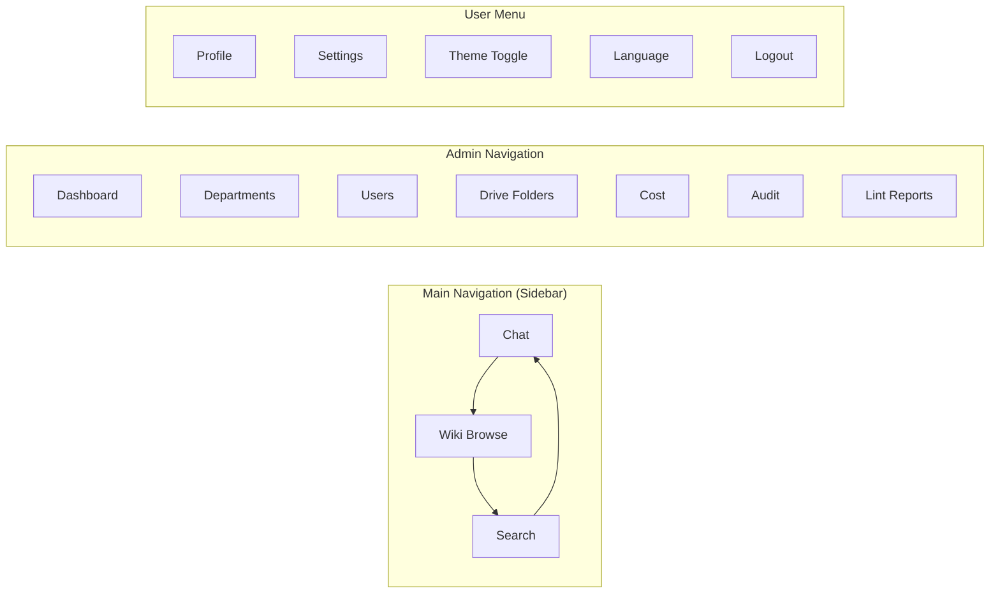

Navigation structure:
- **Knowledge Workers** เห็น: Chat, Wiki Browse, Search (3 items)
- **Department Heads** เห็นเพิ่ม: Department Dashboard, Lint Reports
- **Admins** เห็นเพิ่ม: Full Admin section
- **User menu** อยู่มุมขวาบน: Profile, Settings, Theme, Language, Logout

## 6.6 UX Guidelines for Enterprise Thai Users

| Guideline | Detail |
|-----------|--------|
| Font | IBM Plex Sans Thai หรือ Sarabun สำหรับ body, monospace สำหรับ code |
| Font Size | Base 16px, minimum readable 14px |
| Line Height | 1.6-1.8 สำหรับภาษาไทย (สูงกว่า English เพราะตัวอักษรมีหาง) |
| Color | Neutral palette with blue accent -- ไม่ใช้สีฉูดฉาด |
| Thai Date | รองรับทั้ง พ.ศ. และ ค.ศ. ตาม user preference |
| Honorifics | ใช้คำสุภาพ (ครับ/ค่ะ) ใน system messages |
| Error tone | ไม่ blame user -- "ไม่สามารถดำเนินการได้" ไม่ใช่ "คุณทำผิด" |
| Loading states | ทุกจุดที่ใช้เวลา > 200ms ต้องมี loading indicator |
| Mobile | Responsive design, touch targets >= 44px |

---

# Section 7: PBIs (Product Backlog Items)

## Epic 1: Onboarding & Auth

### PBI-001: Google OAuth SSO Login

**Story:** ในฐานะพนักงาน ฉันต้องการ login ด้วย Google Workspace account เพื่อเข้าใช้งาน DriveWiki โดยไม่ต้องสร้าง account ใหม่

**Business Value:** ลดแรงเสียดทานในการ adopt ระบบใหม่ -- ใช้ identity เดิมที่คุ้นเคย

**Acceptance Criteria:**
- Given ผู้ใช้เปิด DriveWiki → When กด "Login with Google" → Then redirect ไป Google consent screen
- Given ผู้ใช้ให้ consent สำเร็จ → When callback กลับมา → Then สร้าง session + redirect ไปหน้าหลัก
- Given ผู้ใช้ไม่ได้อยู่ใน Google Workspace domain ที่ลงทะเบียน → When พยายาม login → Then แสดง error "บัญชีนี้ไม่ได้อยู่ในองค์กรที่ลงทะเบียน"

**QA Notes:** ทดสอบกับ Google Workspace test domain, test token expiry, test concurrent sessions
**DEV Notes:** ใช้ Passport.js google-oauth2 strategy, store refresh token encrypted
**Figma:** SCR-01 (Landing/Login)
**Dependencies:** None
**Sprint:** 1

---

### PBI-002: JWT Token Management

**Story:** ในฐานะระบบ ฉันต้องออก JWT token ที่มี user context เพื่อ authenticate ทุก API request

**Business Value:** Stateless authentication ที่ scale ได้บน Cloud Run

**Acceptance Criteria:**
- Given user login สำเร็จ → When ระบบออก JWT → Then token มี userId, email, departmentId, role, exp (8h)
- Given JWT หมดอายุ → When user ทำ request → Then ระบบ auto-refresh ด้วย refresh token
- Given user logout → When ทำ request ด้วย old JWT → Then ได้ 401

**QA Notes:** Test token tampering, expired tokens, refresh flow
**DEV Notes:** jose library for JWT, Redis for blacklist
**Figma:** N/A (backend)
**Dependencies:** PBI-001
**Sprint:** 1

---

### PBI-003: PDPA Consent Flow

**Story:** ในฐานะผู้ใช้ครั้งแรก ฉันต้องเห็น PDPA consent form เพื่อให้ความยินยอมก่อนใช้งาน

**Business Value:** PDPA compliance -- ป้องกัน legal risk

**Acceptance Criteria:**
- Given ผู้ใช้ login ครั้งแรก → When เข้าระบบ → Then แสดง consent form ก่อนเข้าหน้าหลัก
- Given ผู้ใช้ไม่ยินยอม → When กด "ไม่ยินยอม" → Then logout + แสดงข้อความอธิบาย
- Given ผู้ใช้ยินยอมแล้ว → When login ครั้งถัดไป → Then ไม่แสดง consent form อีก

**QA Notes:** Test consent withdrawal flow, test consent record in audit log
**DEV Notes:** Store consent timestamp + version in user record
**Figma:** SCR-02 (PDPA Consent)
**Dependencies:** PBI-001
**Sprint:** 1

---

### PBI-004: RBAC Role System

**Story:** ในฐานะ Admin ฉันต้องการกำหนด role ให้ users เพื่อควบคุมสิทธิ์การเข้าถึง

**Business Value:** Data governance -- ป้องกันการเข้าถึงข้อมูลที่ไม่เกี่ยวข้อง

**Acceptance Criteria:**
- Given Admin assign role "DeptHead" → When DeptHead เข้าหน้า Admin → Then เห็นเฉพาะ department ตัวเอง
- Given Member พยายามเข้า Admin section → When ทำ request → Then ได้ 403
- Given Viewer พยายาม create chat → When ส่ง query → Then ได้ 403

**QA Notes:** Test all role x action combinations (matrix test)
**DEV Notes:** Middleware-based role check, permission matrix in config
**Figma:** SCR-10 (User Management)
**Dependencies:** PBI-002
**Sprint:** 1

---

### PBI-005: Workspace Setup Wizard

**Story:** ในฐานะ IT Admin ฉันต้องการ wizard ที่พาฉันตั้งค่า workspace ทีละขั้นตอน เพื่อให้ setup ถูกต้องตั้งแต่ครั้งแรก

**Business Value:** ลดเวลา setup จากหลายชั่วโมงเหลือ < 30 นาที

**Acceptance Criteria:**
- Given Admin เข้าระบบครั้งแรก → When ยังไม่มี workspace → Then แสดง Setup Wizard
- Given Admin อยู่ใน step 3/5 → When กด Back → Then กลับ step 2 โดยไม่สูญเสียข้อมูล
- Given Admin ทำ wizard สำเร็จ → When กด Complete → Then workspace พร้อมใช้งาน + redirect ไป dashboard

**QA Notes:** Test wizard interruption (close browser, refresh), test resume capability
**DEV Notes:** Multi-step form with state persistence (localStorage)
**Figma:** SCR-03 (Setup Wizard)
**Dependencies:** PBI-001, PBI-004
**Sprint:** 1

---

## Epic 2: Drive Integration

### PBI-006: Google Drive Folder Connection

**Story:** ในฐานะ Admin ฉันต้องการเชื่อม Google Drive folders กับ departments เพื่อให้ระบบ monitor เอกสาร

**Business Value:** เป็น foundation ของทุก feature -- ไม่มี folder connection ก็ไม่มี wiki

**Acceptance Criteria:**
- Given Admin เปิดหน้า Drive Folders → When browse folders → Then เห็น folder tree จาก Google Drive
- Given Admin เลือก folder → When กด Connect → Then ระบบ register webhook + เริ่ม initial scan
- Given folder ถูก disconnect → When ระบบ check → Then หยุด monitor + ไม่ลบ wiki pages ที่มีอยู่

**QA Notes:** Test with nested folders, shared drives, large folder trees
**DEV Notes:** Google Drive API v3, service account with domain-wide delegation
**Figma:** SCR-12 (Drive Folder Manager)
**Dependencies:** PBI-005
**Sprint:** 2

---

### PBI-007: Drive Webhook Listener

**Story:** ในฐานะระบบ ฉันต้องรับ webhook จาก Google Drive เมื่อมีเอกสารเปลี่ยนแปลง เพื่อ trigger ingestion

**Business Value:** Real-time awareness -- wiki อัปเดตทันทีเมื่อ source เปลี่ยน

**Acceptance Criteria:**
- Given folder ถูก monitor → When มีไฟล์ใหม่/แก้ไข → Then webhook trigger ภายใน 1 นาที
- Given webhook payload มาถึง → When ระบบประมวลผล → Then queue ingestion job สำหรับ changed files
- Given webhook ล้มเหลว → When scheduled sync รัน → Then จับ changes ที่พลาดได้

**QA Notes:** Test webhook signature verification, test webhook expiry renewal
**DEV Notes:** Google Drive changes.watch API, verify X-Goog-Resource-State header
**Figma:** N/A (backend)
**Dependencies:** PBI-006
**Sprint:** 2

---

### PBI-008: Scheduled Sync Fallback

**Story:** ในฐานะระบบ ฉันต้อง scan Drive folders ทุก 15 นาที เพื่อจับ changes ที่ webhook พลาด

**Business Value:** Reliability -- ไม่พึ่ง webhook 100%

**Acceptance Criteria:**
- Given scheduled sync ถึงเวลา → When scan folders → Then ระบุ files ที่ modified หลัง last sync
- Given file hash ไม่เปลี่ยน → When compare → Then skip ingestion (save cost)
- Given sync error เกิดขึ้น → When retry 3 ครั้ง → Then log error + alert admin

**QA Notes:** Test with 10,000+ files per folder, test hash comparison accuracy
**DEV Notes:** Cloud Scheduler + Cloud Tasks, SHA-256 content hash
**Figma:** SCR-14 (Ingestion Monitor)
**Dependencies:** PBI-006
**Sprint:** 2

---

### PBI-009: Document Content Extraction

**Story:** ในฐานะระบบ ฉันต้อง extract text content จาก Google Docs, Sheets, Slides เพื่อส่งให้ LLM วิเคราะห์

**Business Value:** ครอบคลุมทุก document type ที่องค์กรใช้บ่อย

**Acceptance Criteria:**
- Given Google Doc → When extract → Then ได้ plain text ที่รักษา headings + structure
- Given Google Sheet → When extract → Then ได้ CSV format ที่อ่านง่าย
- Given Google Slides → When extract → Then ได้ text จากทุก slide + speaker notes
- Given ไฟล์ที่ไม่รองรับ → When พยายาม extract → Then skip + log unsupported type

**QA Notes:** Test with Thai-heavy documents, large files (>10MB), embedded images (extract alt text only)
**DEV Notes:** Google Docs/Sheets/Slides export APIs, handle rate limits
**Figma:** N/A (backend)
**Dependencies:** PBI-007
**Sprint:** 2

---

## Epic 3: Wiki Engine (Core)

### PBI-010: Wiki Page Data Model

**Story:** ในฐานะระบบ ฉันต้องมี data model สำหรับ wiki pages ที่รองรับ entity, concept, summary, cross-references

**Business Value:** Foundation ของ Karpathy Wiki Pattern

**Acceptance Criteria:**
- Given Prisma schema defined → When migrate → Then tables created: WikiPage, WikiCrossRef, WikiIndex
- Given wiki page created → When query → Then ได้ type, title, content, metadata, sourceDocIds, version
- Given wiki page updated → When check history → Then old version preserved

**QA Notes:** Test schema migration rollback, test unique constraints
**DEV Notes:** Prisma schema, PostgreSQL with tsvector for FTS
**Figma:** N/A (backend)
**Dependencies:** None
**Sprint:** 2

---

### PBI-011: LLM Entity Extraction Pipeline

**Story:** ในฐานะระบบ ฉันต้อง extract entities (คน, โปรเจค, ผลิตภัณฑ์, แผนก) จากเอกสาร เพื่อสร้าง Entity Pages

**Business Value:** สร้าง knowledge graph อัตโนมัติ -- เชื่อมโยงข้อมูลข้ามเอกสาร

**Acceptance Criteria:**
- Given document text → When LLM analyze → Then extract entities with type, name, description, context
- Given entity ที่มีอยู่แล้ว → When พบใน doc ใหม่ → Then merge information (ไม่ duplicate)
- Given entity ภาษาไทย → When extract → Then รักษาชื่อไทย + transliteration ถ้ามี

**QA Notes:** Test entity deduplication accuracy, test Thai entity recognition
**DEV Notes:** Vertex AI Gemini structured output, entity matching heuristic
**Figma:** N/A (backend)
**Dependencies:** PBI-009, PBI-010
**Sprint:** 3

---

### PBI-012: LLM Concept Extraction Pipeline

**Story:** ในฐานะระบบ ฉันต้อง extract concepts (นโยบาย, กระบวนการ, หลักการ) จากเอกสาร เพื่อสร้าง Concept Pages

**Business Value:** รวบรวมความรู้เชิงแนวคิดจากหลายเอกสาร -- ไม่ต้องอ่านทุกไฟล์

**Acceptance Criteria:**
- Given document text → When LLM analyze → Then extract concepts with name, definition, examples, related docs
- Given concept ที่มีอยู่แล้ว → When พบข้อมูลใหม่ → Then enrich existing concept page
- Given concept ขัดแย้งกับ existing → When detect → Then flag for lint review

**QA Notes:** Test concept boundary detection (เมื่อไรควรเป็น page ใหม่ vs merge)
**DEV Notes:** Prompt engineering critical -- need structured output schema
**Figma:** N/A (backend)
**Dependencies:** PBI-009, PBI-010
**Sprint:** 3

---

### PBI-013: Summary Page Generation

**Story:** ในฐานะระบบ ฉันต้องสร้าง summary page สำหรับทุก document ที่ ingest เพื่อให้อ่านเร็ว

**Business Value:** ผู้ใช้เห็นสรุปโดยไม่ต้องเปิดเอกสารต้นฉบับ

**Acceptance Criteria:**
- Given document ingested → When processing complete → Then summary page created (max 500 words)
- Given summary → When render → Then มี: title, one-paragraph summary, key points, source link
- Given bilingual document → When summarize → Then สรุปเป็นภาษาหลักของเอกสาร + brief in secondary language

**QA Notes:** Test summary quality with domain expert review
**DEV Notes:** Gemini summarization prompt, enforce word limit
**Figma:** Wiki page detail view
**Dependencies:** PBI-009, PBI-010
**Sprint:** 3

---

### PBI-014: Cross-Reference Management

**Story:** ในฐานะระบบ ฉันต้อง maintain cross-references ระหว่าง wiki pages อัตโนมัติ

**Business Value:** Knowledge graph ที่ navigable -- หัวใจของ Karpathy pattern

**Acceptance Criteria:**
- Given entity page สร้างใหม่ → When scan existing pages → Then สร้าง cross-refs ไปยัง pages ที่เกี่ยวข้อง
- Given cross-ref → When navigate → Then ทำงานได้ทั้งสองทิศทาง (bidirectional)
- Given page ถูกลบ → When check refs → Then cross-refs ชี้ไปยัง page นั้นถูก cleanup

**QA Notes:** Test ref integrity after bulk operations, test circular reference handling
**DEV Notes:** Separate CrossRef table, bidirectional insert
**Figma:** Wiki page detail -- cross-ref sidebar
**Dependencies:** PBI-011, PBI-012
**Sprint:** 3

---

### PBI-015: Master Index Generation

**Story:** ในฐานะระบบ ฉันต้อง maintain Master Index ที่อัปเดตอัตโนมัติ เพื่อให้ Chat Engine ค้นหา wiki pages ได้เร็ว

**Business Value:** Performance -- ไม่ต้อง scan ทุก page ทุกครั้งที่ query

**Acceptance Criteria:**
- Given wiki pages exist → When generate index → Then index มี: title, type, keywords, summary สำหรับทุก page
- Given new page created → When index update → Then page อยู่ใน index ภายใน 30 วินาที
- Given search query → When search index → Then return ranked results < 1 วินาที

**QA Notes:** Test index with 50,000+ pages, test Thai keyword search
**DEV Notes:** PostgreSQL tsvector + GIN index, custom Thai tokenizer consideration
**Figma:** N/A (backend)
**Dependencies:** PBI-010
**Sprint:** 3

---

### PBI-016: Wiki Full-Text Search

**Story:** ในฐานะ knowledge worker ฉันต้องการค้นหา wiki pages ด้วย keyword (ไทย/อังกฤษ)

**Business Value:** ค้นหาเร็ว ไม่ต้องพึ่ง chat ทุกครั้ง

**Acceptance Criteria:**
- Given search query "นโยบายการลา" → When search → Then return relevant concept/entity pages ranked by relevance
- Given search query in English → When search → Then return results regardless of page language
- Given no results → When display → Then show "ไม่พบผลลัพธ์" + suggest alternative queries

**QA Notes:** Test Thai word segmentation, test mixed Thai-English queries
**DEV Notes:** PostgreSQL FTS with pg_trgm for fuzzy matching
**Figma:** SCR-07 (Wiki Search Results)
**Dependencies:** PBI-015
**Sprint:** 3

---

## Epic 4: Chat

### PBI-017: Chat Session Management

**Story:** ในฐานะ knowledge worker ฉันต้องการเริ่มและจัดการ chat sessions เพื่อถามคำถามเกี่ยวกับความรู้องค์กร

**Business Value:** Primary interaction model -- 80% ของ usage จะเป็น chat

**Acceptance Criteria:**
- Given user authenticated → When click "New Chat" → Then session created + empty chat displayed
- Given sessions exist → When click session list → Then see all sessions with last message preview
- Given user wants to delete → When delete session → Then session removed (soft delete)

**QA Notes:** Test session limit per user (configurable), test session list performance
**DEV Notes:** WebSocket for real-time, REST for CRUD
**Figma:** SCR-04 (Chat)
**Dependencies:** PBI-002
**Sprint:** 4

---

### PBI-018: Wiki-First Query Processing

**Story:** ในฐานะระบบ ฉันต้อง process queries โดยค้นหา wiki pages ก่อน เพื่อให้คำตอบเร็วและถูกต้อง

**Business Value:** Core Karpathy pattern -- wiki in context > retrieval

**Acceptance Criteria:**
- Given user query → When process → Then search master index → load top-K wiki pages → synthesize answer
- Given wiki pages ครอบคลุมคำถาม → When answer → Then response < 3 seconds (p95)
- Given answer → When display → Then มี citations ชี้ไป wiki pages ที่ใช้

**QA Notes:** Test with various query types (factual, procedural, comparative)
**DEV Notes:** Vertex AI Gemini, context window management, page selection algorithm
**Figma:** SCR-04 (Chat -- answer display)
**Dependencies:** PBI-015, PBI-017
**Sprint:** 4

---

### PBI-019: Raw Source Fallback

**Story:** ในฐานะระบบ เมื่อ wiki ไม่มีคำตอบเพียงพอ ฉันต้อง fallback ไปค้นหาจาก raw documents

**Business Value:** ครอบคลุม -- ไม่ทิ้งผู้ใช้แม้ wiki ยังไม่ complete

**Acceptance Criteria:**
- Given wiki confidence ต่ำ → When fallback → Then fetch relevant Drive documents → re-synthesize
- Given fallback answer → When display → Then ระบุชัดเจนว่า "ข้อมูลจากเอกสารต้นฉบับ (ยังไม่อยู่ใน wiki)"
- Given fallback answer ที่มีคุณค่า → When evaluate → Then auto-file เป็น wiki page ใหม่

**QA Notes:** Test fallback latency (< 8 sec), test accuracy comparison wiki vs fallback
**DEV Notes:** Confidence threshold configurable, Drive API rate limit handling
**Figma:** SCR-04 (Chat -- fallback indicator)
**Dependencies:** PBI-018
**Sprint:** 4

---

### PBI-020: Knowledge Compounding (Auto-File)

**Story:** ในฐานะระบบ เมื่อ chat answer มีคุณค่าสูง ฉันต้อง auto-file เป็น wiki page ใหม่

**Business Value:** Knowledge compounds -- ทุก query ทำให้ wiki ดีขึ้น (Karpathy key insight)

**Acceptance Criteria:**
- Given high-value answer (based on LLM evaluation) → When file → Then create new "Filed" type wiki page
- Given filed page → When created → Then update cross-references + master index
- Given user rates answer "helpful" → When check → Then increase filing confidence

**QA Notes:** Test filing criteria, test duplicate detection (don't file similar answers)
**DEV Notes:** LLM evaluator prompt for answer value assessment
**Figma:** SCR-04 (Chat -- "filed" notification)
**Dependencies:** PBI-018, PBI-014
**Sprint:** 4

---

### PBI-021: Chat Streaming Response

**Story:** ในฐานะ knowledge worker ฉันต้องเห็นคำตอบแบบ streaming เพื่อไม่ต้องรอนาน

**Business Value:** UX -- ผู้ใช้เห็น progress ทันทีแทนที่จะรอ blank screen

**Acceptance Criteria:**
- Given query sent → When processing → Then tokens stream ทีละตัว (Server-Sent Events)
- Given streaming → When complete → Then citations appear at bottom
- Given stream error → When detect → Then display error + allow retry

**QA Notes:** Test SSE connection stability, test reconnect on disconnect
**DEV Notes:** Server-Sent Events, not WebSocket (simpler, Cloud Run compatible)
**Figma:** SCR-04 (Chat -- streaming state)
**Dependencies:** PBI-018
**Sprint:** 4

---

### PBI-022: Answer Rating

**Story:** ในฐานะ knowledge worker ฉันต้องการ rate คำตอบ เพื่อช่วยปรับปรุงระบบ

**Business Value:** Feedback loop สำหรับ continuous improvement

**Acceptance Criteria:**
- Given answer displayed → When show rating → Then thumbs up/down buttons appear
- Given user rates "not helpful" → When submit → Then optional comment input shown
- Given ratings collected → When admin view → Then aggregate satisfaction rate visible

**QA Notes:** Test rating analytics accuracy
**DEV Notes:** Simple POST endpoint, aggregate in cost/usage dashboard
**Figma:** SCR-04 (Chat -- rating prompt)
**Dependencies:** PBI-021
**Sprint:** 4

---

## Epic 5: Admin & Governance

### PBI-023: Department Management UI

**Story:** ในฐานะ Admin ฉันต้องการสร้างและจัดการ departments เพื่อ scope ความรู้ตามโครงสร้างองค์กร

**Business Value:** Data isolation -- แผนก HR ไม่เห็นข้อมูลแผนก Finance ที่ไม่ share

**Acceptance Criteria:**
- Given Admin → When create department → Then department appears in list + ready for folder assignment
- Given department → When edit name/policies → Then changes saved + reflected immediately
- Given department with data → When delete → Then soft delete + data archived (not destroyed)

**QA Notes:** Test cascading effects of department delete
**DEV Notes:** Prisma soft delete pattern
**Figma:** SCR-11 (Department Management)
**Dependencies:** PBI-005
**Sprint:** 2

---

### PBI-024: User Management UI

**Story:** ในฐานะ Admin ฉันต้องการจัดการ users -- assign departments, set roles

**Business Value:** Governance -- ควบคุมว่าใครเข้าถึงอะไร

**Acceptance Criteria:**
- Given Admin → When view user list → Then see: name, email, department, role, last active, status
- Given Admin → When change user role → Then role updated immediately + audit logged
- Given Admin → When deactivate user → Then user cannot login + sessions revoked

**QA Notes:** Test bulk user operations, test self-deactivation prevention
**DEV Notes:** DataTable component with inline editing
**Figma:** SCR-10 (User Management)
**Dependencies:** PBI-004, PBI-023
**Sprint:** 3

---

### PBI-025: Content Policy Editor

**Story:** ในฐานะ Department Head ฉันต้องการ set content policies เพื่อควบคุมว่า documents แบบไหนจะ ingest

**Business Value:** Governance -- ป้องกัน sensitive documents เข้า wiki โดยไม่ตั้งใจ

**Acceptance Criteria:**
- Given DeptHead → When open policy editor → Then see current rules (include/exclude by title pattern, mime type)
- Given DeptHead → When add rule "exclude title contains CONFIDENTIAL" → Then policy saved
- Given policy active → When new file matches exclude rule → Then file skipped + log entry

**QA Notes:** Test complex rule combinations, test regex injection prevention
**DEV Notes:** JSON-based policy schema, evaluated before ingestion
**Figma:** SCR-13 (Content Policy Editor)
**Dependencies:** PBI-023
**Sprint:** 3

---

### PBI-026: Admin Usage Dashboard

**Story:** ในฐานะ Admin ฉันต้องเห็น dashboard แสดง usage metrics เพื่อ justify ROI

**Business Value:** ROI justification -- แสดงให้ executives เห็นว่าระบบมีคุณค่า

**Acceptance Criteria:**
- Given Admin → When open dashboard → Then see: total users, active users, queries/day, wiki pages, storage used
- Given dashboard → When select date range → Then charts update (daily/weekly/monthly view)
- Given dashboard → When filter by department → Then metrics scoped to selected department

**QA Notes:** Test with large datasets, test chart rendering performance
**DEV Notes:** Aggregate queries with materialized views for performance
**Figma:** SCR-09 (Admin Dashboard)
**Dependencies:** PBI-024
**Sprint:** 5

---

### PBI-027: Ingestion Monitor UI

**Story:** ในฐานะ Admin ฉันต้องเห็น status ของ document ingestion เพื่อ monitor และ troubleshoot

**Business Value:** Operational visibility -- รู้ว่าระบบทำงานถูกต้อง

**Acceptance Criteria:**
- Given ingestion running → When view monitor → Then see: progress bar, files processed/total, errors
- Given ingestion error → When view → Then see specific file + error message + retry button
- Given Admin → When click "Re-ingest" → Then selected file re-queued for ingestion

**QA Notes:** Test with 1000+ file ingestion batch, test progress accuracy
**DEV Notes:** Cloud Tasks job status tracking, polling endpoint
**Figma:** SCR-14 (Ingestion Monitor)
**Dependencies:** PBI-007
**Sprint:** 3

---

## Epic 6: Audit & Compliance

### PBI-028: HMAC Audit Logging

**Story:** ในฐานะระบบ ฉันต้อง log ทุก action ด้วย HMAC signature เพื่อให้ tamper-evident

**Business Value:** Compliance + trust -- พิสูจน์ได้ว่า log ไม่ถูกแก้ไข

**Acceptance Criteria:**
- Given any user action → When complete → Then audit log entry created with HMAC-SHA256 signature
- Given log entries → When chain → Then each entry signs (content + previous HMAC)
- Given log chain → When verify → Then detect any tampered entry

**QA Notes:** Test chain integrity with 100,000+ entries, test performance of verification
**DEV Notes:** HMAC-SHA256 with server-side secret (Secret Manager), chain hash pattern
**Figma:** N/A (backend)
**Dependencies:** None
**Sprint:** 2

---

### PBI-029: Audit Log Viewer

**Story:** ในฐานะ Compliance Officer ฉันต้องดูและค้นหา audit logs เพื่อตรวจสอบการใช้งาน

**Business Value:** Compliance -- ตอบคำถาม auditor ได้ทันที

**Acceptance Criteria:**
- Given Compliance Officer → When open audit viewer → Then see filterable log table
- Given filters applied → When search → Then results filtered by: user, action, resource, date range
- Given log entry → When view detail → Then see full metadata + HMAC integrity status (pass/fail)

**QA Notes:** Test with large date ranges, test filter combinations
**DEV Notes:** DataTable with server-side pagination + filtering
**Figma:** SCR-16 (Audit Log Viewer)
**Dependencies:** PBI-028
**Sprint:** 4

---

### PBI-030: Audit Export

**Story:** ในฐานะ Compliance Officer ฉันต้อง export audit logs เป็นไฟล์ เพื่อส่งให้ external auditor

**Business Value:** Compliance workflow -- auditor ต้องการไฟล์

**Acceptance Criteria:**
- Given date range selected → When export → Then generate CSV/JSON file
- Given file generated → When download → Then via signed GCS URL (expires 24h)
- Given export → When file → Then include HMAC integrity verification result per entry

**QA Notes:** Test large exports (1M+ entries), test export timeout handling
**DEV Notes:** Async export job, GCS signed URL
**Figma:** SCR-16 (Audit Log Viewer -- export button)
**Dependencies:** PBI-029
**Sprint:** 4

---

## Epic 7: Cost Management

### PBI-031: Token Usage Tracking

**Story:** ในฐานะระบบ ฉันต้อง track LLM token usage ทุก call เพื่อคำนวณ cost

**Business Value:** Cost transparency -- รู้ว่าใช้เท่าไร

**Acceptance Criteria:**
- Given LLM call → When complete → Then record: input tokens, output tokens, model, user, department, timestamp
- Given usage tracked → When query → Then aggregate by user/department/day
- Given Gemini pricing update → When configure → Then cost calculation uses new rates

**QA Notes:** Test accuracy against Vertex AI billing
**DEV Notes:** Parse Vertex AI response metadata for token counts
**Figma:** N/A (backend)
**Dependencies:** None
**Sprint:** 3

---

### PBI-032: Cost Dashboard

**Story:** ในฐานะ Admin ฉันต้องเห็น cost breakdown ตาม department เพื่อจัดการ budget

**Business Value:** Budget control -- prevent surprise bills

**Acceptance Criteria:**
- Given Admin → When open cost dashboard → Then see: total cost, cost by department, cost by operation type
- Given dashboard → When select period → Then see trend chart (daily/weekly/monthly)
- Given department → When click → Then see per-user cost breakdown

**QA Notes:** Test cost calculation accuracy, test with mock data at scale
**DEV Notes:** Materialized view for aggregation, estimated cost = tokens * rate
**Figma:** SCR-15 (Cost Dashboard)
**Dependencies:** PBI-031, PBI-026
**Sprint:** 5

---

### PBI-033: Department Cost Quota

**Story:** ในฐานะ Admin ฉันต้องตั้ง monthly budget limit per department เพื่อป้องกัน cost overrun

**Business Value:** Cost governance -- ไม่ให้แผนกใดใช้เกินงบ

**Acceptance Criteria:**
- Given Admin → When set quota $500/month for department X → Then quota saved
- Given department approaching 80% quota → When check → Then alert sent to DeptHead
- Given department hit 100% quota → When user query → Then get message "แผนกใช้งบประมาณครบแล้ว กรุณาติดต่อ admin"

**QA Notes:** Test quota enforcement timing, test edge cases (quota reached mid-query)
**DEV Notes:** Pre-check before LLM call, alert at 80% + 90% + 100%
**Figma:** SCR-15 (Cost Dashboard -- quota settings)
**Dependencies:** PBI-031
**Sprint:** 5

---

## Epic 8: Wiki Quality (Lint)

### PBI-034: Lint Scheduler

**Story:** ในฐานะระบบ ฉันต้อง run wiki lint ตาม schedule เพื่อรักษาคุณภาพ wiki อัตโนมัติ

**Business Value:** Quality assurance -- wiki ดีขึ้นเรื่อยๆ โดยไม่ต้องอาศัยคน

**Acceptance Criteria:**
- Given lint schedule configured (default: weekly) → When cron fires → Then lint job starts for each department
- Given lint job → When running → Then check: contradictions, stale pages, orphans, missing refs
- Given lint complete → When done → Then report available in admin dashboard

**QA Notes:** Test concurrent lint jobs across departments, test resource consumption
**DEV Notes:** Cloud Scheduler, department-level isolation for parallel execution
**Figma:** N/A (backend)
**Dependencies:** PBI-010
**Sprint:** 5

---

### PBI-035: Contradiction Detection

**Story:** ในฐานะ lint agent ฉันต้อง detect contradictions ระหว่าง wiki pages

**Business Value:** Accuracy -- ป้องกัน misinformation ใน wiki

**Acceptance Criteria:**
- Given wiki pages → When LLM compare → Then identify contradictory claims with evidence
- Given contradiction found → When report → Then list: page A claim vs page B claim + source docs
- Given Admin reviews → When acknowledge → Then contradiction marked as "reviewed"

**QA Notes:** Test false positive rate, test with intentionally contradictory data
**DEV Notes:** Pairwise comparison with LLM, prioritize pages with common entities
**Figma:** SCR-17 (Lint Report)
**Dependencies:** PBI-034
**Sprint:** 5

---

### PBI-036: Stale Page Detection

**Story:** ในฐานะ lint agent ฉันต้อง detect wiki pages ที่ source document เปลี่ยนแปลงแล้วแต่ wiki ยังไม่ update

**Business Value:** Freshness -- wiki ต้องสะท้อนข้อมูลล่าสุด

**Acceptance Criteria:**
- Given wiki page with sourceDocIds → When source doc modified after page update → Then flag as stale
- Given stale page → When auto-fix enabled → Then re-ingest source + update wiki page
- Given stale page → When manual review → Then DeptHead can approve/reject update

**QA Notes:** Test staleness detection accuracy, test auto-fix quality
**DEV Notes:** Compare DriveDocument.googleModifiedAt vs WikiPage.updatedAt
**Figma:** SCR-17 (Lint Report -- stale section)
**Dependencies:** PBI-034
**Sprint:** 5

---

### PBI-037: Orphan Page Cleanup

**Story:** ในฐานะ lint agent ฉันต้อง identify orphan pages ที่ไม่มี cross-references ชี้เข้ามา

**Business Value:** Wiki hygiene -- ไม่ให้มี pages ที่ไม่มีใครค้นเจอ

**Acceptance Criteria:**
- Given wiki page → When no incoming cross-references → Then flag as orphan
- Given orphan page → When report → Then suggest: create cross-ref, merge with existing page, or archive
- Given Admin → When archive orphan → Then page status = "Archived" (not deleted)

**QA Notes:** Test with index pages (should not be flagged as orphan)
**DEV Notes:** Graph query on CrossRef table
**Figma:** SCR-17 (Lint Report -- orphan section)
**Dependencies:** PBI-034, PBI-014
**Sprint:** 5

---

## Epic 9: UI & UX Polish

### PBI-038: Wiki Browse UI

**Story:** ในฐานะ knowledge worker ฉันต้องการ browse wiki pages ตาม category เพื่อสำรวจความรู้แผนก

**Business Value:** Discoverability -- ผู้ใช้เจอข้อมูลที่ไม่รู้ว่ามีอยู่

**Acceptance Criteria:**
- Given user → When open Wiki Browse → Then see categories: Entity, Concept, Summary, Filed
- Given category selected → When view list → Then paginated list with title, type, last updated
- Given page clicked → When open → Then rendered markdown with cross-ref sidebar

**QA Notes:** Test with 10,000+ pages per category, test infinite scroll performance
**DEV Notes:** Server-side pagination, markdown-it for rendering
**Figma:** SCR-05, SCR-06 (Wiki Browse, Page Detail)
**Dependencies:** PBI-010, PBI-016
**Sprint:** 4

---

### PBI-039: Dark Mode Support

**Story:** ในฐานะผู้ใช้ ฉันต้องการ dark mode เพื่อใช้งานสบายตาในที่แสงน้อย

**Business Value:** UX comfort -- enterprise users ทำงาน 8+ ชั่วโมง

**Acceptance Criteria:**
- Given user → When toggle theme → Then switch between Light/Dark/System
- Given Dark mode → When view → Then all screens readable with proper contrast (WCAG AA)
- Given System mode → When OS changes → Then theme follows OS preference

**QA Notes:** Test all screens in dark mode, test contrast ratios
**DEV Notes:** CSS variables theme system, Tailwind dark: prefix
**Figma:** All screens -- dark variants
**Dependencies:** None (can parallel)
**Sprint:** 5

---

### PBI-040: Bilingual UI (Thai/English)

**Story:** ในฐานะผู้ใช้ ฉันต้องการสลับภาษา UI ระหว่างไทยกับอังกฤษ

**Business Value:** SEA market -- expat workers need English, Thai workers prefer Thai

**Acceptance Criteria:**
- Given user → When switch language → Then all UI labels change immediately (no reload)
- Given Thai selected → When view → Then all system messages in Thai (สุภาพ)
- Given English selected → When view → Then all system messages in English

**QA Notes:** Test all screens in both languages, test text overflow with Thai (longer than English)
**DEV Notes:** i18next + react-i18next, namespace per module
**Figma:** All screens -- test with Thai text
**Dependencies:** None (can parallel)
**Sprint:** 3

---

### PBI-041: Responsive Mobile Layout

**Story:** ในฐานะผู้ใช้มือถือ ฉันต้องการใช้งาน DriveWiki บนมือถือได้สะดวก

**Business Value:** Accessibility -- 40%+ ของ enterprise users เข้าจากมือถือ

**Acceptance Criteria:**
- Given mobile viewport → When view → Then sidebar collapses to hamburger menu
- Given chat on mobile → When type → Then keyboard does not obscure input
- Given wiki page on mobile → When read → Then text readable, images responsive

**QA Notes:** Test on iOS Safari + Android Chrome, test touch targets >= 44px
**DEV Notes:** Tailwind responsive breakpoints, test with Chrome DevTools
**Figma:** Mobile variants of key screens
**Dependencies:** None (can parallel)
**Sprint:** 5

---

### PBI-042: Empty States & Error Handling UI

**Story:** ในฐานะผู้ใช้ ฉันต้องเห็น friendly empty states และ error messages เพื่อไม่สับสน

**Business Value:** UX polish -- first impressions matter in enterprise sales

**Acceptance Criteria:**
- Given empty wiki → When view → Then show illustration + "ยังไม่มี wiki pages -- ระบบกำลัง ingest เอกสาร"
- Given API error → When occur → Then show user-friendly Thai message + retry button
- Given loading state → When > 200ms → Then show skeleton loader

**QA Notes:** Test all empty states per screen, test network error scenarios
**DEV Notes:** EmptyState + ErrorBoundary components, skeleton loaders
**Figma:** All screens -- empty/error states
**Dependencies:** None
**Sprint:** 4

---

### PBI-043: Keyboard Navigation & Accessibility

**Story:** ในฐานะผู้ใช้ที่มีข้อจำกัดทางกายภาพ ฉันต้องใช้ DriveWiki ด้วย keyboard ได้

**Business Value:** WCAG 2.1 AA compliance -- enterprise requirement

**Acceptance Criteria:**
- Given user → When navigate with Tab → Then logical focus order across all screens
- Given interactive element → When focused → Then visible focus indicator
- Given screen reader → When read page → Then semantic HTML + aria labels

**QA Notes:** Test with VoiceOver (macOS), test tab order, test color contrast
**DEV Notes:** Semantic HTML, aria attributes, focus management
**Figma:** N/A (implementation concern)
**Dependencies:** None
**Sprint:** 5

---

## Sprint Allocation Summary

| Sprint | Duration | PBIs | Focus |
|--------|----------|------|-------|
| **Sprint 1** | 2 weeks | PBI-001, 002, 003, 004, 005 | Auth, Onboarding, RBAC foundation |
| **Sprint 2** | 2 weeks | PBI-006, 007, 008, 009, 010, 023, 028 | Drive integration, Data model, Department mgmt, Audit foundation |
| **Sprint 3** | 2 weeks | PBI-011, 012, 013, 014, 015, 016, 024, 025, 027, 031, 040 | Wiki Engine (core), User mgmt, Content policies, Cost tracking, i18n |
| **Sprint 4** | 2 weeks | PBI-017, 018, 019, 020, 021, 022, 029, 030, 038, 042 | Chat Engine (core), Audit viewer, Wiki Browse, Error handling |
| **Sprint 5** | 2 weeks | PBI-026, 032, 033, 034, 035, 036, 037, 039, 041, 043 | Admin dashboard, Cost dashboard, Lint engine, Dark mode, Mobile, a11y |

---

# Section 8: Role Summary

## What Each Role Can Start Immediately

### Product Manager (PM)
- ตรวจสอบ BRD section -- validate business goals กับ stakeholders จริง
- จัด prioritization workshop กับ executives เพื่อยืนยัน P0/P1
- สร้าง competitor analysis deck จาก Section 2
- กำหนด success metrics tracking plan ตาม KPIs ใน Section 4.2
- สร้าง go-to-market plan สำหรับ Thai enterprise market

### UX Designer
- สร้าง user research plan สำหรับ Thai enterprise users (5+ interviews)
- ออกแบบ wireframes สำหรับ 5 key flows ใน Section 6.2
- สร้าง design system (typography, colors, spacing สำหรับ Thai)
- ออกแบบ empty states + error states ทุกหน้าจอ
- สร้าง prototype สำหรับ usability testing

### Developer (Dev)
- Set up project scaffolding (Next.js + TypeScript + Prisma + Cloud SQL)
- สร้าง Prisma schema ตาม ER diagram ใน Section 3.5
- Implement OAuth flow (PBI-001, 002)
- Set up Cloud Run deployment pipeline
- Spike: evaluate Thai full-text search options ใน PostgreSQL

### QA Engineer
- สร้าง test strategy document ตาม NFRs ใน Section 3.6
- เตรียม test environments (Google Workspace test domain)
- สร้าง test matrix สำหรับ RBAC (role x action)
- วางแผน performance test (1000 concurrent users)
- สร้าง security test checklist (OWASP Top 10)

### Compliance Officer
- Review PDPA requirements map ใน BR-COMP section
- สร้าง data flow diagram สำหรับ PDPA documentation
- Review HMAC audit trail design (Section 5.6)
- สร้าง data retention policy draft
- Review consent flow design (PBI-003)

---

# Section 9: Open Questions & Gaps

## Open Questions

| # | Question | Owner | Impact | Deadline |
|---|---------|-------|--------|----------|
| OQ-01 | Gemini 2.5 Pro มี quota เท่าไรสำหรับ enterprise tier? ต้อง reserved capacity ไหม? | Dev Lead + GCP Account Team | HIGH -- กระทบ scalability | Before Sprint 2 |
| OQ-02 | Thai word segmentation ใน PostgreSQL FTS ใช้อะไร? ICU? Custom tokenizer? Third-party extension? | Dev Lead | HIGH -- กระทบ search quality | Before Sprint 3 |
| OQ-03 | Karpathy's minbpe tokenizer รองรับ Thai script ไหม? ต้อง train custom BPE model? | ML Engineer | MEDIUM -- experimental feature | Before Sprint 5 |
| OQ-04 | Context window ของ Gemini 2.5 Pro (1M tokens) เพียงพอสำหรับ department wiki ทั้งหมดหรือต้อง hierarchical loading? | Architect | HIGH -- กระทบ core architecture | Before Sprint 3 |
| OQ-05 | PDPA consent form ต้อง legal review -- ใครเป็น legal counsel? | PM + Legal | HIGH -- กระทบ launch | Before Sprint 1 |
| OQ-06 | Google Workspace domain-wide delegation -- ทุกองค์กรเป้าหมาย grant ได้ไหม? มี policy ที่ห้ามไหม? | PM + Sales | HIGH -- กระทบ onboarding | Before Sprint 2 |
| OQ-07 | Buddhist calendar (พ.ศ.) display -- ใช้ library อะไร? มี standard ไหม? | Dev Lead | LOW -- UX polish | Before Sprint 3 |
| OQ-08 | Cloud Run max timeout 3600s -- เพียงพอสำหรับ initial ingestion ของ workspace ที่มี 100,000 docs? | Architect | MEDIUM -- อาจต้อง Cloud Tasks | Before Sprint 2 |
| OQ-09 | Pricing model สำหรับ DriveWiki -- per-user? per-department? flat rate? กระทบ cost tracking design | PM + Business | MEDIUM -- กระทบ feature scope | Before Sprint 3 |
| OQ-10 | Data residency -- ลูกค้าใน Thailand ต้องการ data อยู่ใน Thailand region ไหม? (GCP ยังไม่มี Thailand region) | PM + Compliance | HIGH -- กระทบ architecture | Before Sprint 1 |
| OQ-11 | Wiki schema (Layer 3) -- ใช้ YAML config file หรือ database-driven? ใครเป็นคน edit? | Architect + PM | MEDIUM -- กระทบ admin UX | Before Sprint 3 |
| OQ-12 | qmd hybrid search -- implement ใน v1.0 ไหม? หรือ PostgreSQL FTS เพียงพอก่อน? | Architect | MEDIUM -- กระทบ Sprint 5 scope | Before Sprint 4 |

## Compliance Notice

> **PDPA / Data Governance Notice**
>
> DriveWiki ประมวลผลข้อมูลส่วนบุคคลที่มีความอ่อนไหว (ชื่อ, อีเมล, department, query history)
> และเอกสารภายในองค์กร ก่อน launch ต้อง:
>
> 1. **Data Protection Impact Assessment (DPIA)** -- ประเมินความเสี่ยงด้านข้อมูลส่วนบุคคล
> 2. **Legal Review** -- consent form, privacy policy, data processing agreement
> 3. **Data Residency Confirmation** -- ยืนยัน GCP region ที่ลูกค้ายอมรับ
> 4. **Penetration Test** -- ก่อน production deployment
> 5. **Third-party Audit** -- HMAC audit trail integrity verification by external party

---

## Do's and Don'ts

### Do's
- DO ใช้ Karpathy's 3-layer pattern อย่างเคร่งครัด -- Raw Sources, Wiki, Schema
- DO enforce department scoping ทุก endpoint -- ไม่มี exception
- DO log ทุก action ด้วย HMAC chain -- แม้แต่ read operations
- DO ใช้ structured output จาก Gemini สำหรับ entity/concept extraction
- DO track cost ทุก LLM call -- transparency คือ trust
- DO test Thai language processing thoroughly ก่อน commit feature
- DO cache wiki pages aggressively -- ลด LLM calls
- DO implement graceful degradation -- ถ้า Vertex AI down, show cached wiki
- DO version ทุก wiki page change -- ต้อง traceable
- DO use Server-Sent Events สำหรับ streaming (Cloud Run compatible)

### Don'ts
- DON'T ให้ human edit wiki pages directly -- Agent owns wiki layer (Karpathy principle)
- DON'T store raw document content ใน Cloud SQL -- ใช้ GCS สำหรับ raw, DB สำหรับ metadata/wiki
- DON'T use WebSocket (Cloud Run has limitations) -- ใช้ SSE แทน
- DON'T ignore context window limits -- implement hierarchical index loading
- DON'T skip HMAC signing แม้แต่ entry เดียว -- chain integrity ขึ้นกับ completeness
- DON'T assume Gemini Thai quality -- validate with native speakers
- DON'T hardcode LLM pricing -- ต้อง configurable
- DON'T deploy without PDPA legal review
- DON'T use fine-tuned models ใน v1 -- Gemini base + good prompts เพียงพอ
- DON'T over-engineer schema layer -- start simple, iterate

---

## Agent Prompt Guide (Handoff Prompts)

### For Spider-Man (Implementation)

**Prompt 1 -- Project Scaffolding:**
```
Set up DriveWiki project: Next.js 15 + TypeScript + Prisma + PostgreSQL 16.
Create the Prisma schema from the ER diagram in drivewiki-superspec.md Section 3.5.
Entities: Workspace, Department, User, DriveFolder, DriveDocument, WikiPage,
WikiCrossRef, WikiIndex, ChatSession, ChatMessage, AuditLog, CostEvent.
Include tsvector field on WikiIndex for full-text search.
Set up Cloud SQL connection via Cloud SQL Auth Proxy.
```

**Prompt 2 -- OAuth Flow:**
```
Implement Google OAuth 2.0 SSO per FR-AUTH-01 through FR-AUTH-10.
Use Passport.js google-oauth2 strategy.
Issue JWT with: userId, email, departmentId, role, exp (8h configurable).
Store refresh token encrypted in Cloud SQL. Implement RBAC middleware
that checks role hierarchy: SuperAdmin > Admin > DeptHead > Member > Viewer.
Add department scoping middleware that enforces data isolation.
```

**Prompt 3 -- Wiki Ingest Pipeline:**
```
Implement the Ingest Agent per FR-INGEST-01 through FR-INGEST-15.
Three ingestion triggers: (1) Drive webhook, (2) scheduled sync every 15min,
(3) manual trigger from admin. For each document: download via Drive API,
compute SHA-256 hash (skip if unchanged), extract text (Docs->plain, Sheets->CSV,
Slides->text), send to Vertex AI Gemini for entity/concept/summary extraction,
create/update wiki pages, update cross-references, update master index.
Use Cloud Tasks for queue management. Track token cost per call.
```

**Prompt 4 -- Chat Engine:**
```
Implement Chat Engine per FR-CHAT-01 through FR-CHAT-12.
Wiki-first pattern: (1) search master index for relevant pages,
(2) load top-K pages into Gemini context, (3) synthesize answer with citations.
If confidence < threshold, fallback to raw Drive docs. Use Server-Sent Events
for streaming response (not WebSocket -- Cloud Run compatible).
Implement knowledge compounding: LLM evaluates answer value, auto-file as
wiki page if high-value. Track session cost.
```

### For Thor (DevOps/Infrastructure)

**Prompt 5 -- GCP Infrastructure:**
```
Provision DriveWiki infrastructure on GCP asia-southeast1:
- Cloud Run service (min 1, max 50 instances, 2 vCPU, 4GB RAM)
- Cloud SQL PostgreSQL 16 Enterprise (HA, automated backup, PITR)
- Cloud Memorystore Redis (for caching + session store)
- GCS bucket (raw doc cache, exports)
- Cloud Scheduler (15min sync, weekly lint)
- Cloud Tasks queue (ingestion jobs)
- Secret Manager (OAuth secrets, HMAC key, DB password)
- VPC connector for Cloud Run -> Cloud SQL
Use Terraform. Set up CI/CD with Cloud Build.
```

---

*End of DriveWiki Super Spec v1.0*
*Pending Loki Review for Plan-Approval Gate*
